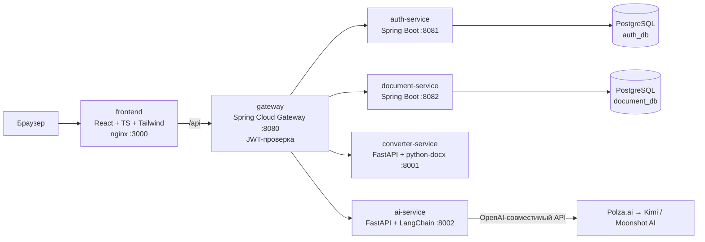

# CourseWorkMaker (md2docx)

Онлайн-редактор Markdown с живым DOCX-превью и точным экспортом курсовой работы
по **ГОСТ 7.32-2017**, плюс ИИ-агент, генерирующий курсовую целиком.

- слева — Markdown-редактор с подсветкой синтаксиса, вставкой картинок, таблиц,
  кода, mermaid-схем и LaTeX-формул;
- справа — постраничное превью А4 «как в Word»: титульный лист, содержание,
  нумерация страниц/рисунков/таблиц/формул по ГОСТ;
- кнопка **«Скачать .docx»** — точная серверная конвертация в Word-документ;
- кнопка **«Сгенерировать с ИИ»** — агент (LangChain + Kimi через прокси
  [Polza.ai](https://polza.ai/docs/gaidy)) пишет работу по теме и загруженным
  материалам, сам проверяет себя и кладёт markdown в редактор.

## Архитектура

Микросервисы за единым API-шлюзом; фронтенд раздаётся nginx и проксирует `/api`.



| Сервис | Стек | Назначение |
|---|---|---|
| `frontend` | React 18, TypeScript, Vite, Tailwind, KaTeX, Mermaid | Редактор, ГОСТ-превью, страница входа, модалка ИИ-генерации |
| `gateway` | Java 21, Spring Cloud Gateway | Единая точка входа, маршрутизация, валидация JWT, прокидывание `X-User-Id` |
| `auth-service` | Java 21, Spring Boot, JPA, Flyway, BCrypt, JJWT | Регистрация, вход, профиль, смена пароля, выпуск JWT |
| `document-service` | Java 21, Spring Boot, JPA, Flyway | Хранение документов пользователя (markdown + настройки) |
| `converter-service` | Python 3.12, FastAPI, python-docx, latex2mathml | Точная конвертация MD → DOCX по ГОСТ 7.32-2017 |
| `ai-service` | Python 3.12, FastAPI, LangChain, Kimi (через Polza.ai) | Генерация курсовой: план → разделы → самопроверка → доводка |
| `postgres` | PostgreSQL 16 | Базы `auth_db` и `document_db` |

### Безопасность

- JWT (HS256) выпускает auth-service, проверяет **только** gateway;
  внутренним сервисам личность передаётся заголовком `X-User-Id`
  (клиентские `X-User-*` всегда вырезаются на шлюзе).
- Публичные маршруты: `POST /api/auth/login`, `POST /api/auth/register`.
  Всё остальное (`/api/documents`, `/api/convert`, `/api/ai`) — только с токеном.
- Пароли — BCrypt; загрузка изображений конвертером защищена от SSRF
  (приватные адреса блокируются, лимит 10 МБ).

### Как устроена конвертация по ГОСТ (converter-service)

- А4; поля 30/15/20/20 мм; Times New Roman 14 пт; полуторный интервал;
  абзацный отступ 1,25 см; выравнивание по ширине (п. 6.1.1);
- структурные заголовки (ВВЕДЕНИЕ, ЗАКЛЮЧЕНИЕ, СПИСОК ИСПОЛЬЗОВАННЫХ
  ИСТОЧНИКОВ) — прописными по центру, каждый раздел с новой страницы (п. 6.2.1);
- разделы/подразделы нумеруются автоматически (`#`, `##`, `###` в markdown —
  номера ставить не нужно);
- содержание — настоящее поле TOC Word с отточием: обновляется само при
  открытии документа (страницы всегда точные);
- «Рисунок N — …» по центру под иллюстрацией, «Таблица N — …» слева над
  таблицей, формулы по центру с номером `(N)` справа (пп. 6.5–6.8);
- формулы LaTeX конвертируются в нативные формулы Word (OMML);
- mermaid-схемы фронтенд рендерит в PNG и передаёт конвертеру;
- нумерация страниц по центру снизу, на титульном листе номер скрыт (п. 6.3).

### Как устроен ИИ-агент (ai-service)

1. **План**: модель составляет структуру по ГОСТ (введение, разделы
   с подразделами, заключение, список источников) — строгий JSON.
2. **Генерация**: каждый раздел пишется отдельным вызовом с учётом плана,
   уже написанных разделов и загруженных файлов (PDF/DOCX/TXT/MD).
3. **Самопроверка**: каждый раздел прогоняется через «нормоконтролёра»
   (отдельный вызов с temperature=0), который чинит подписи таблиц/рисунков,
   mermaid-синтаксис и научный стиль.
4. **Финальный линт**: программная проверка структуры; при замечаниях — ещё
   один исправляющий вызов.

Перед запуском выбирается уровень «Быстро / Баланс / Качество» — пользователь
видит только уровень и примерную цену в рублях (цены берутся с Polza.ai через
`GET /api/ai/pricing`); конкретные модели задаются переменными `AI_MODEL_*`.

Прогресс виден в UI (этап + проценты), задача выполняется асинхронно
(`POST /api/ai/generate` → `jobId`, опрос `GET /api/ai/jobs/{id}`). Окно можно
закрыть — генерация продолжится в фоне, прогресс показывается в кнопке шапки,
готовый текст сам попадёт в редактор. Задачу можно принудительно остановить
(`POST /api/ai/jobs/{id}/cancel`); при закрытии вкладки браузера с активной
задачей показывается предупреждение.

Кроме генерации с нуля есть **правка по запросу**: в той же модалке вкладка
«Исправить текущий текст» — опишите словами, что изменить, и ИИ вернёт
исправленную версию всего документа (`POST /api/ai/edit`).

**Графики от ИИ.** Опция «Графики (строит ИИ)» включает агентный режим: ИИ
пишет скрипты `matplotlib` (блок ` ```matplotlib `), а ai-service выполняет их
в изолированной песочнице (подпроцесс с AST-блоклистом опасных конструкций,
лимитом CPU и таймаутом) и встраивает готовые PNG прямо в отчёт — как Claude
Code, только песочница на сервере. Это единственный способ получить настоящие
графики по данным: Polza — чистый прокси моделей и сам код не исполняет.

**Картинки из интернета.** Опция «Картинки из интернета» разрешает ИИ
предлагать ссылки на реальные изображения; ai-service скачивает их
SSRF-безопасно (`web_images.py`: только http(s), блок приватных адресов, лимит
10 МБ, проверка content-type) и встраивает как ассеты. Битые/недоступные
ссылки заменяются заглушкой. Качество зависит от того, насколько модель знает
рабочие прямые URL (надёжнее всего `upload.wikimedia.org`).

**Приложение с кодом.** Опция добавляет в конец работы структурный раздел
«Приложение А. Листинг кода» с листингами по теме (блоки ```python и др.).

**Титульный лист** в модалке генерации — те же поля, что в настройках превью;
он собирается автоматически (без ИИ), данные титульника к модели не уходят.

## Запуск

Требуется Docker + Docker Compose.

```bash
cp .env.example .env
# отредактируйте .env: задайте JWT_SECRET и AI_API_KEY (ключ Polza.ai)
docker compose up --build
```

- Приложение: <http://localhost:3000>
- API-шлюз: <http://localhost:8080>

Без `AI_API_KEY` всё работает, кроме ИИ-генерации (сервис вернёт понятную
ошибку «не сконфигурирован»).

### Переменные окружения (`.env`)

| Переменная | Описание |
|---|---|
| `JWT_SECRET` | Секрет подписи JWT, ≥32 байт (`openssl rand -base64 48`) |
| `POSTGRES_USER` / `POSTGRES_PASSWORD` | Учётные данные PostgreSQL |
| `AI_API_KEY` | Ключ API [Polza.ai](https://polza.ai/docs/gaidy) (или другого OpenAI-совместимого прокси) |
| `AI_BASE_URL` | Базовый URL OpenAI-совместимого API (по умолчанию `https://polza.ai/api/v1`) |
| `AI_MODEL_FAST` | Модель уровня «Быстро» (по умолчанию `google/gemini-2.5-flash`) |
| `AI_MODEL_BALANCED` | Модель уровня «Баланс» (по умолчанию `openai/gpt-5-mini`), также используется для правок |
| `AI_MODEL_QUALITY` | Модель уровня «Качество» (по умолчанию `anthropic/claude-sonnet-4.6`) |

### Режим разработки

```bash
# бэкенд целиком в докере
docker compose up postgres gateway auth-service document-service converter-service ai-service

# фронтенд с hot-reload (vite проксирует /api на localhost:8080)
cd frontend && npm install && npm run dev   # http://localhost:5173
```

Тесты конвертера:

```bash
cd services/converter
docker build -t cwm-converter . && docker run --rm -v "$PWD/tests:/srv/tests" cwm-converter python -m pytest tests -q
```

## API (через gateway)

| Метод и путь | Авторизация | Описание |
|---|---|---|
| `POST /api/auth/register` | — | Регистрация → `{token, user}` |
| `POST /api/auth/login` | — | Вход → `{token, user}` |
| `GET /api/auth/me` | JWT | Текущий пользователь |
| `PUT /api/auth/me` | JWT | Имя/почта (возвращает новый токен) |
| `PUT /api/auth/me/password` | JWT | Смена пароля |
| `GET/POST /api/documents`, `GET/PUT/DELETE /api/documents/{id}` | JWT | Документы пользователя |
| `POST /api/convert/docx` | JWT | `{markdown, docName, settings, assets}` → файл .docx |
| `POST /api/ai/generate` | JWT | multipart: `options` (JSON) + `files[]` → `{jobId}` |
| `POST /api/ai/edit` | JWT | `{instruction, markdown}` → `{jobId}` — правка документа по запросу |
| `GET /api/ai/jobs/{id}` | JWT | Статус/прогресс/результат генерации |
| `POST /api/ai/jobs/{id}/cancel` | JWT | Принудительная остановка задачи |
| `GET /api/ai/pricing` | JWT | Цены уровней качества (₽ за млн токенов) |

## Диалект Markdown

| Конструкция | Что получится в DOCX |
|---|---|
| `# Название` | Раздел «N Название», с новой страницы (номер автоматически) |
| `# Введение` / `# Заключение` / `# Список…` | Структурный заголовок прописными по центру |
| `## / ###` | Подраздел N.M / пункт N.M.K |
| `Таблица: Название` + GFM-таблица | «Таблица N — Название» + таблица с границами |
| `Рисунок: Название` + ```` ```mermaid ```` или `` | Иллюстрация + «Рисунок N — Название» |
| Кнопка «Вставить изображение» в тулбаре | Картинка с устройства: в текст попадает ссылка `asset:img-…`, сам файл хранится локально и передаётся конвертеру |
| Кнопка «Загрузить .md» в тулбаре | Открывает свой Markdown-файл в редакторе; `http(s)`/`data:`-картинки работают сразу, для локальных ссылок предлагается приложить файлы (сопоставляются по имени), неприложенные становятся заглушками |
| `$$…$$`, `$…$` | Формула Word (OMML) с номером `(N)` |
| ```` ```python ```` | Листинг в рамке, Courier New 12 пт |
| `1. / -` списки | `1)` / `–` перечисления (в списке литературы — `1.`) |
