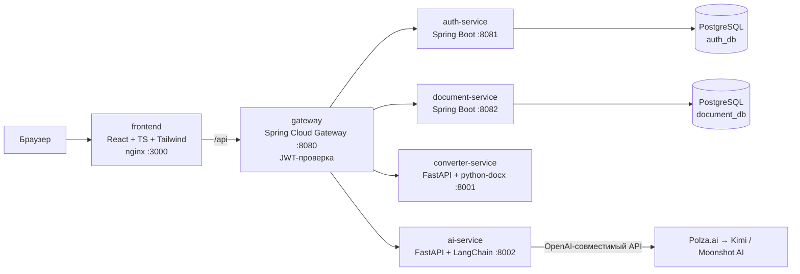

# CourseWorkMaker (md2docx)

<p align="center">
  <b>Онлайн-редактор Markdown с живым DOCX-превью и точным экспортом курсовой работы по ГОСТ 7.32-2017</b>
</p>

<p align="center">
  
  
  
  
  
  
</p>

## 📋 Содержание

- [Описание](#описание)
- [Функции](#функции)
- [Архитектура](#архитектура)
- [Технологический стек](#технологический-стек)
- [Быстрый старт](#быстрый-старт)
- [Переменные окружения](#переменные-окружения)
- [Режим разработки](#режим-разработки)
- [API](#api)
- [Диалект Markdown](#диалект-markdown)
- [Безопасность](#безопасность)
- [Структура проекта](#структура-проекта)
- [Лицензия](#лицензия)

## Описание

CourseWorkMaker — это веб-приложение для написания и оформления курсовых работ по стандарту **ГОСТ 7.32-2017**. Редактор объединяет удобство Markdown с точным соответствием требованиям оформления документов в высших учебных заведениях России.

**Ключевые возможности:**
- 📝 **Markdown-редактор** с подсветкой синтаксиса, вставкой картинок, таблиц, кода, mermaid-схем и LaTeX-формул
- 👁️ **Живое превью А4** «как в Word» — титульный лист, содержание, нумерация страниц/рисунков/таблиц/формул по ГОСТ
- 📥 **Экспорт в DOCX** — точная серверная конвертация в Word-документ
- 🤖 **ИИ-генерация** — агент (LangChain + Kimi через прокси Polza.ai) пишет работу по теме и загруженным материалам, сам проверяет себя и кладёт markdown в редактор

## Функции

### Редактор
- Подсветка синтаксиса Markdown
- Вставка изображений с устройства
- Таблицы с автоматическим оформлением
- Блоки кода с подсветкой
- Mermaid-диаграммы (автоматически рендерятся в PNG)
- LaTeX-формулы (inline `$...$` и display `$$...$$`)
- Горячие клавиши: `Ctrl/Cmd+B` — жирный, `Ctrl/Cmd+I` — курсив, `Ctrl/Cmd+S` — сохранить
- Автосохранение в локальное хранилище и в облако (для вошедших)
- **Несколько документов**: список работ в облаке (создание, переключение, удаление)
- **Экспорт .zip** (markdown + картинки) — резервная копия и перенос на другое устройство
- Целевой объём работы: прогресс «N из ~M стр.» в статус-баре

### Превью
- Постраничное отображение А4
- Титульный лист из свободных блоков: подходит и для курсовой по ГОСТ, и для
  отчётов по лабораторным — несколько исполнителей, «Принял:», логотип вуза,
  произвольная шапка
- Автоматическое содержание
- Нумерация страниц, рисунков, таблиц, формул
- Структурные заголовки (ВВЕДЕНИЕ, ЗАКЛЮЧЕНИЕ, СПИСОК ИСПОЛЬЗОВАННЫХ ИСТОЧНИКОВ) — прописными по центру

### Экспорт
- Конвертация в DOCX с точным соответствием ГОСТ 7.32-2017
- Настоящее поле TOC Word с отточием
- OMML-формулы (нативные формулы Word)
- Нумерация страниц по центру снизу, на титульном листе номер скрыт

### ИИ-генерация
- **План**: модель составляет структуру по ГОСТ (введение, разделы с подразделами, заключение, список источников)
- **Генерация**: каждый раздел пишется отдельным вызовом с учётом плана и загруженных файлов
- **Самопроверка**: «нормоконтролёр» исправляет подписи, mermaid-синтаксис и научный стиль
- **Финальный линт**: программная проверка структуры
- **Графики**: ИИ пишет matplotlib-скрипты, сервис выполняет их в изолированной песочнице
- **Картинки из интернета**: SSRF-безопасная загрузка изображений
- **Приложение с кодом**: структурный раздел «Приложение А. Листинг кода»
- **Три уровня качества**: Быстро / Баланс / Качество
- **Живой предпросмотр**: готовые разделы видны прямо во время генерации; если
  начало не нравится — остановите работу раньше и сэкономьте деньги
- **Отмена без потерь**: при остановке генерации уже написанные разделы остаются
  в редакторе
- **Правка документа**: режим «Правка» в консоли — опишите, что изменить, и ИИ
  перепишет документ; результат применяется сразу, дальше правите текст руками

## Архитектура



### Поток запросов

1. Пользователь открывает приложение в браузере (`localhost:3000`)
2. Фронтенд (nginx) раздаёт статику и проксирует `/api` на шлюз
3. Gateway (`:8080`) проверяет JWT и маршрутизирует запросы во внутренние сервисы
4. Внутренние сервисы получают идентификатор пользователя через заголовок `X-User-Id`

## Технологический стек

| Сервис | Стек | Назначение |
|--------|------|------------|
| `frontend` | React 18, TypeScript, Vite, Tailwind CSS, KaTeX, Mermaid | Редактор, ГОСТ-превью, страница входа, модалка ИИ-генерации |
| `gateway` | Java 21, Spring Cloud Gateway | Единая точка входа, маршрутизация, валидация JWT, прокидывание `X-User-Id` |
| `auth-service` | Java 21, Spring Boot, JPA, Flyway, BCrypt, JJWT | Регистрация, вход, профиль, смена пароля, выпуск JWT |
| `document-service` | Java 21, Spring Boot, JPA, Flyway | Хранение документов пользователя (markdown + настройки) |
| `converter-service` | Python 3.12, FastAPI, python-docx, latex2mathml | Точная конвертация MD → DOCX по ГОСТ 7.32-2017 |
| `ai-service` | Python 3.12, FastAPI, LangChain, Kimi (через Polza.ai) | Генерация курсовой: план → разделы → самопроверка → доводка |
| `postgres` | PostgreSQL 16 | Базы `auth_db` и `document_db` |

## Быстрый старт

### Требования

- [Docker](https://docs.docker.com/get-docker/) 24.0+
- [Docker Compose](https://docs.docker.com/compose/install/) 2.20+
- 4 GB RAM (8 GB для ИИ-генерации)

### Установка и запуск

```bash
# 1. Клонируйте репозиторий
git clone git@github.com:alexdarenkov/CourseWorkMaker.git
cd CourseWorkMaker

# 2. Создайте файл окружения
cp .env.example .env

# 3. Отредактируйте .env (обязательно JWT_SECRET, опционально AI_API_KEY)
nano .env

# 4. Запустите все сервисы
docker compose up --build

# 5. Откройте приложение
open http://localhost:3000
```

> **Без `AI_API_KEY`** всё работает, кроме ИИ-генерации (сервис вернёт понятную ошибку «не сконфигурирован»).

### Первый запуск

1. Откройте `http://localhost:3000`
2. Зарегистрируйтесь или войдите
3. Начните писать в Markdown-редакторе
4. Настройте титульный лист через кнопку «Настройки»
5. Скачайте DOCX через кнопку «Скачать .docx»

## Переменные окружения

Создайте файл `.env` на основе `.env.example`:

| Переменная | Обязательная | Описание | Пример |
|------------|-------------|----------|--------|
| `JWT_SECRET` | ✅ | Секрет подписи JWT (HS256), минимум 32 байта | `openssl rand -base64 48` |
| `POSTGRES_USER` | ❌ | Пользователь PostgreSQL | `coursework` |
| `POSTGRES_PASSWORD` | ❌ | Пароль PostgreSQL | `coursework` |
| `AI_API_KEY` | ❌ | Ключ API [Polza.ai](https://polza.ai/docs/gaidy) | `sk-...` |
| `AI_BASE_URL` | ❌ | Базовый URL OpenAI-совместимого API | `https://polza.ai/api/v1` |
| `AI_MODEL_FAST` | ❌ | Модель уровня «Быстро» | `google/gemini-2.5-flash` |
| `AI_MODEL_BALANCED` | ❌ | Модель уровня «Баланс» | `openai/gpt-5-mini` |
| `AI_MODEL_QUALITY` | ❌ | Модель уровня «Качество» | `anthropic/claude-sonnet-4.6` |

### Генерация JWT_SECRET

```bash
openssl rand -base64 48
```

### Получение AI_API_KEY

1. Зарегистрируйтесь на [polza.ai](https://polza.ai)
2. Создайте API-ключ в личном кабинете
3. Скопируйте ключ в `.env`

## Режим разработки

### Бэкенд в Docker, фронтенд с hot-reload

```bash
# Запускаем бэкенд
docker compose up postgres gateway auth-service document-service converter-service ai-service

# В отдельном терминале — фронтенд с hot-reload
cd frontend
npm install
npm run dev
```

Фронтенд будет доступен на `http://localhost:5173`, Vite проксирует `/api` на `localhost:8080`.

### Тесты

```bash
# Конвертер (парсер, сборка DOCX по ГОСТ)
cd services/converter
docker build -t cwm-converter .
docker run --rm -v "$PWD/tests:/srv/tests" cwm-converter python -m pytest tests -q

# ИИ-сервис (линт документа, нормализация плана, песочница matplotlib, job'ы)
cd services/ai
docker build -t cwm-ai .
docker run --rm -v "$PWD/tests:/srv/tests" cwm-ai python -m pytest tests -q

# Фронтенд (парсер Markdown, ГОСТ-рендер превью, метрики строк)
cd frontend
npm run test
```

### Сборка фронтенда

```bash
cd frontend
npm run build  # tsc -b && vite build
```

### Пересборка отдельного сервиса

```bash
docker compose build <service-name>
docker compose up -d <service-name>
```

## API

Все запросы (кроме авторизации) идут через Gateway (`http://localhost:8080`) с заголовком `Authorization: Bearer <token>`.

### Авторизация

| Метод | Путь | Описание |
|-------|------|----------|
| `POST` | `/api/auth/register` | Регистрация → `{token, user}` |
| `POST` | `/api/auth/login` | Вход → `{token, user}` |
| `GET` | `/api/auth/me` | Текущий пользователь |
| `PUT` | `/api/auth/me` | Имя/почта (возвращает новый токен) |
| `PUT` | `/api/auth/me/password` | Смена пароля |

### Документы

| Метод | Путь | Описание |
|-------|------|----------|
| `GET` | `/api/documents` | Список документов пользователя |
| `POST` | `/api/documents` | Создать/сохранить документ |
| `GET` | `/api/documents/{id}` | Получить документ |
| `PUT` | `/api/documents/{id}` | Обновить документ |
| `DELETE` | `/api/documents/{id}` | Удалить документ |

### Конвертация

| Метод | Путь | Описание |
|-------|------|----------|
| `POST` | `/api/convert/docx` | `{markdown, docName, settings, assets}` → файл .docx |

### ИИ-генерация

| Метод | Путь | Описание |
|-------|------|----------|
| `POST` | `/api/ai/generate` | multipart: `options` (JSON) + `files[]` → `{jobId}` |
| `POST` | `/api/ai/edit` | `{instruction, markdown}` → `{jobId}` — правка всего документа, результат применяется сразу |
| `GET` | `/api/ai/jobs/{id}` | Статус/прогресс/результат; `partial` — готовые разделы по мере генерации |
| `POST` | `/api/ai/jobs/{id}/cancel` | Принудительная остановка задачи |
| `GET` | `/api/ai/pricing` | Цены уровней качества (₽ за млн токенов) |

## Диалект Markdown

| Конструкция | Результат в DOCX |
|-------------|-----------------|
| `# Название` | Раздел «N Название», с новой страницы (номер автоматически) |
| `# Введение` / `# Заключение` / `# Список…` | Структурный заголовок прописными по центру |
| `# Реферат` (первый заголовок) | Страница реферата сразу после титульного листа — до содержания и без записи в нём |
| `## / ###` | Подраздел N.M / пункт N.M.K |
| `Таблица: Название` + GFM-таблица | «Таблица N — Название» + таблица с границами |
| `Рисунок: Название` + ` ```mermaid ` ` или `` | Иллюстрация + «Рисунок N — Название» |
| `$$…$$`, `$…$` | Формула Word (OMML) с номером `(N)` |
| ` ```python ` ` | Листинг в рамке, Courier New 12 пт |
| `1. / -` списки | `1)` / `–` перечисления (в списке литературы — номер без точки, с абзацного отступа) |
| Enter (перенос строки) | Любой перенос строки в редакторе = перенос в выводе (превью и DOCX). Пустая строка — новый абзац. Абзац с переносами выравнивается по левому краю |

### Вставка изображений

- **С устройства**: кнопка «Вставить изображение» в тулбаре — картинка хранится локально, в тексте ссылка `asset:img-…`
- **Из интернета**: `` — конвертер скачает при экспорте
- **Mermaid-диаграммы**: ` ```mermaid ` ` — фронтенд рендерит в PNG, конвертер встраивает в DOCX

### Загрузка Markdown-файла

Кнопка «Загрузить .md / .zip» в тулбаре открывает свой Markdown-файл или архив:
- **`.zip` (md + картинки внутри)** — markdown берётся из корневого `.md`, картинки
  сопоставляются по относительному пути автоматически (ничего выбирать не нужно)
- **`.md`** — `http(s)`/`data:`-картинки работают сразу; для локальных ссылок можно
  приложить файлы вручную (или загрузить `.zip`)
- Неприложенные/ненайденные изображения становятся заглушками

## Безопасность

- **JWT (HS256)**: выпускает auth-service, проверяет **только** gateway
- **Внутренние сервисы**: личность передаётся заголовком `X-User-Id` (клиентские `X-User-*` всегда вырезаются на шлюзе)
- **Публичные маршруты**: `POST /api/auth/login`, `POST /api/auth/register`
- **Всё остальное**: требует JWT-токен
- **Пароли**: хеширование BCrypt
- **SSRF-защита**: загрузка изображений конвертером блокирует приватные адреса, лимит 10 МБ
- **Песочница matplotlib**: AST-блоклист опасных конструкций, лимит CPU, таймаут 30 секунд

## Структура проекта

```
CourseWorkMaker/
├── frontend/                    # React + TypeScript + Vite фронтенд
│   ├── src/
│   │   ├── components/          # UI-компоненты (редактор, превью, модалки)
│   │   ├── lib/               # Утилиты: парсер Markdown, рендер ГОСТ, пагинация
│   │   ├── pages/             # Страницы (редактор, авторизация)
│   │   ├── auth/              # Контекст авторизации
│   │   └── api/               # HTTP-клиент
│   ├── index.html
│   ├── package.json
│   ├── tsconfig.json
│   ├── vite.config.ts
│   ├── tailwind.config.js
│   ├── Dockerfile
│   └── nginx.conf
│
├── services/
│   ├── gateway/               # Java Spring Cloud Gateway
│   │   └── src/main/java/...
│   ├── auth/                  # Java Spring Boot — авторизация
│   │   └── src/main/java/...
│   ├── document/              # Java Spring Boot — документы
│   │   └── src/main/java/...
│   ├── converter/             # Python FastAPI — конвертация MD → DOCX
│   │   ├── app/
│   │   │   ├── md_parser.py   # Парсер Markdown
│   │   │   ├── gost.py        # Сборка DOCX по ГОСТ
│   │   │   ├── omml.py        # OMML-формулы Word
│   │   │   └── images.py      # Загрузка изображений
│   │   ├── tests/
│   │   ├── requirements.txt
│   │   └── Dockerfile
│   └── ai/                    # Python FastAPI — ИИ-генерация
│       ├── app/
│       │   ├── agent.py        # ИИ-агент
│       │   ├── figures.py      # Генерация графиков
│       │   ├── matplotlib_exec.py  # Песочница matplotlib
│       │   ├── files.py        # Обработка загруженных файлов
│       │   └── jobs.py         # Асинхронные задачи
│       ├── requirements.txt
│       └── Dockerfile
│
├── infra/
│   └── postgres/
│       └── init-databases.sh   # Инициализация БД
│
├── docker-compose.yml          # Orchestration всех сервисов
├── .env.example               # Шаблон переменных окружения
├── .gitignore                 # Исключения Git
└── README.md                  # Этот файл
```

## ГОСТ 7.32-2017 — что реализовано

| Требование | Реализация |
|-----------|-----------|
| Формат А4 | ✅ |
| Поля: левое 30 мм, верхнее 20 мм, правое 15 мм, нижнее 20 мм | ✅ |
| Шрифт Times New Roman, 14 пт | ✅ |
| Полуторный межстрочный интервал | ✅ |
| Абзацный отступ 1,25 см | ✅ |
| Выравнивание по ширине | ✅ |
| Нумерация разделов автоматическая | ✅ |
| Структурные заголовки прописными по центру | ✅ |
| Каждый раздел с новой страницы | ✅ |
| Реферат после титульного листа, до содержания и без записи в нём | ✅ |
| Точка в конце заголовка не ставится | ✅ (срезается автоматически) |
| Содержание с отточием | ✅ (настоящее поле TOC Word) |
| Отступы записей содержания: подраздел 0,5 см, пункт 1 см | ✅ |
| Нумерация рисунков, таблиц, формул | ✅ |
| Подписи рисунков по центру под иллюстрацией | ✅ (многострочные — одинарным интервалом) |
| Подписи таблиц слева над таблицей | ✅ |
| Формулы по центру с номером справа, свободные строки вокруг | ✅ |
| Пояснения к формуле со слова «где» без двоеточия, каждое с красной строки | ✅ |
| Список источников: номера без точки, с абзацного отступа | ✅ |
| Нумерация страниц по центру снизу шрифтом основного текста | ✅ |
| На титульном листе номер скрыт | ✅ |
| Превью и DOCX совпадают постранично | ✅ (одинаковое число страниц и номера в содержании) |

## Лицензия

MIT License — свободное использование для образовательных и коммерческих целей.

---

<p align="center">
  Сделано с ❤️ для студентов и не только
</p>
