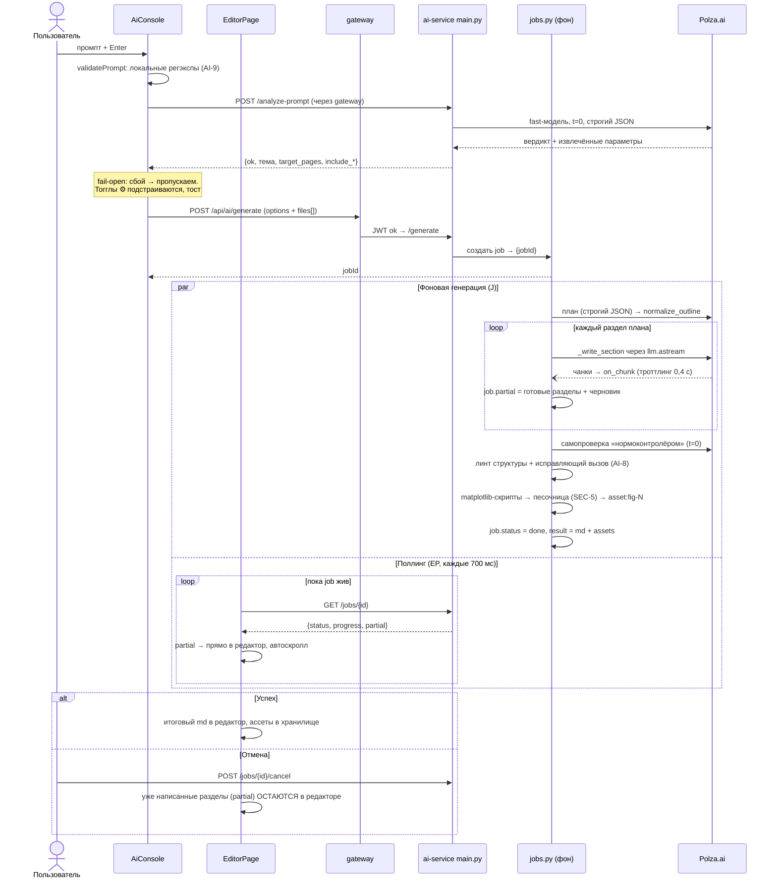

# Поток: ИИ-генерация отчёта

Самый насыщенный сценарий системы: асинхронный job, стриминг через поллинг,
отмена. Поведение — спека `ai-agent.md` (AI-1..AI-11); здесь — как части
взаимодействуют во времени. Это же — главная зона гонок (см. внизу).

## Правка (режим «Правка» в консоли)

Короче генерации: локальная `validatePrompt` → `POST /edit` → job →
результат применяется в редактор СРАЗУ (AI-6, без diff-просмотра и без
истории откатов). Дальше пользователь правит текст руками.

## Зоны гонок (для аудита)

Это места, где проще всего сломать поведение; при изменениях проверять руками:

1. **Пользователь печатает во время стриминга** — partial перезаписывает
   редактор каждые 700 мс.
2. **Переключение/создание документа во время генерации** — job продолжает
   жить и пишет partial уже в НОВЫЙ документ.
3. **Отмена в момент прихода чанка** — partial фиксируется в редакторе
   (`onMdChange`), поллинг останавливается.
4. **Два окна/вкладки** — job один, поллят оба, редакторы разные.
