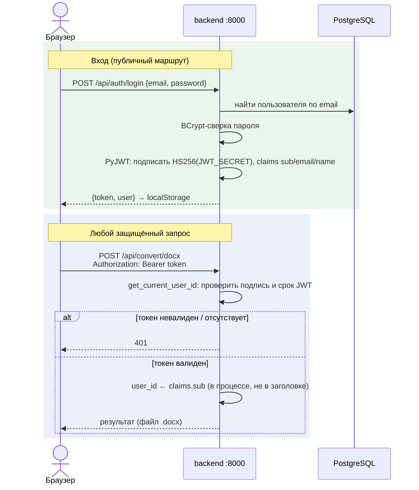

# Поток: аутентификация

Модель доверия — спека `security.md` (SEC-1/SEC-2). Здесь — как она работает
по шагам. После перехода на монолит вход и проверка токена — в одном сервисе.

## Что важно знать

- Проверка JWT — одна FastAPI-зависимость `get_current_user_id`
  (`app/security.py`); заголовка `X-User-Id` больше нет (SEC-1), подделывать
  личность между сервисами нечем — сервис один.
- Наружу открыт только фронт (`:3000`) — он проксирует `/api` на backend той
  же сети; порт backend (`:8000`) нужен лишь dev-серверу vite и в проде
  закрывается override'ом.
- Профиль/смена пароля — обычные защищённые маршруты (`/api/auth/me`,
  `PUT …/password`); смена имени/почты возвращает НОВЫЙ токен (claims
  изменились).
- Секрет `JWT_SECRET` и алгоритм HS256 те же, что были у Java-сервисов —
  ранее выпущенные токены остаются валидными.
