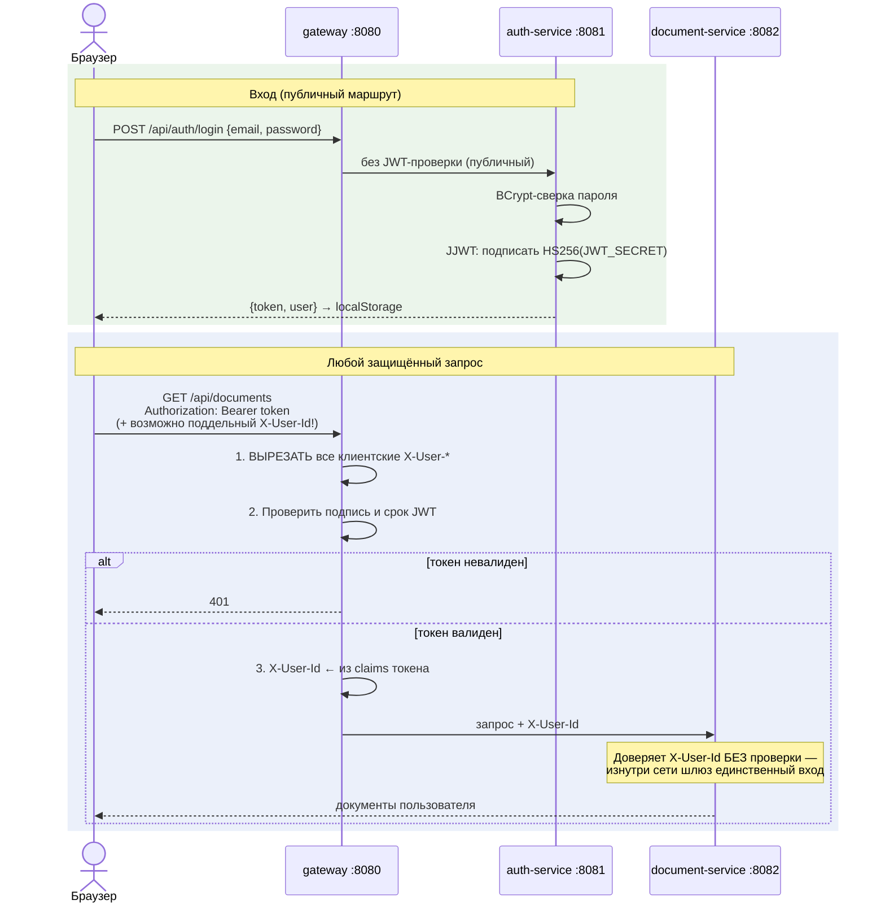

# Поток: аутентификация и доверие между сервисами

Модель доверия — спека `security.md` (SEC-1/SEC-2). Здесь — как она
работает по шагам.

## Что важно знать

- Порядок на шлюзе принципиален: сначала вырезать клиентские `X-User-*`,
  потом подставить свой — иначе подделка личности (Gherkin-сценарий в SEC-1).
- Внутренние сервисы НЕ знают `JWT_SECRET` и не проверяют токены — вся
  аутентификация в одной точке (`JwtAuthFilter.java`).
- Следствие: внутренние порты (8001/8002/8081/8082) нельзя публиковать
  наружу — они доверяют заголовку. Наружу открыты только 3000 и 8080.
- Профиль/смена пароля — обычные защищённые маршруты auth-service
  (`/api/auth/me`, `PUT …/password`); смена имени/почты возвращает НОВЫЙ
  токен (claims изменились).
