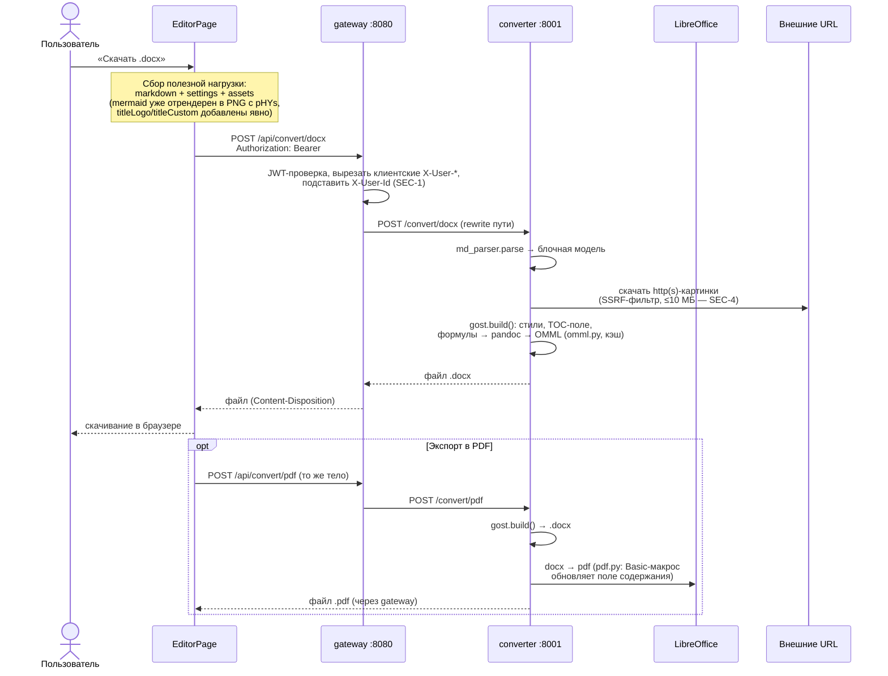

# Поток: экспорт в DOCX / PDF

Кнопка «Скачать» в шапке. Конвертация серверная (см. `overview.md`, почему
не client-side). Правила сборки документа — спеки `gost-layout.md`,
`pagination.md`, `markdown-dialect.md`.

## Что важно знать

- **Ассеты передаются явно.** Картинки не лежат в markdown — там ссылки
  `asset:<key>`, а PNG-данные идут в поле `assets`. Логотип титульника и
  titleCustom — ассеты вне markdown, их добавляет `download()` (GL-9/GL-10).
- **Каждая формула гоняется через pandoc** (`markdown→docx`, извлекается
  `<m:oMath>`) с кэшем — MD-7.
- **PDF — это DOCX + LibreOffice.** Поле содержания заполняется реальными
  номерами страниц макросом; профиль LibreOffice готовится при сборке образа.
  Именно этот PDF — эталон для сверки постраничного паритета с превью
  (`pagination.md`, «Верификация»).
- Таймаут ответа gateway — 120 с; большие документы с десятками формул
  укладываются за счёт кэша OMML.
