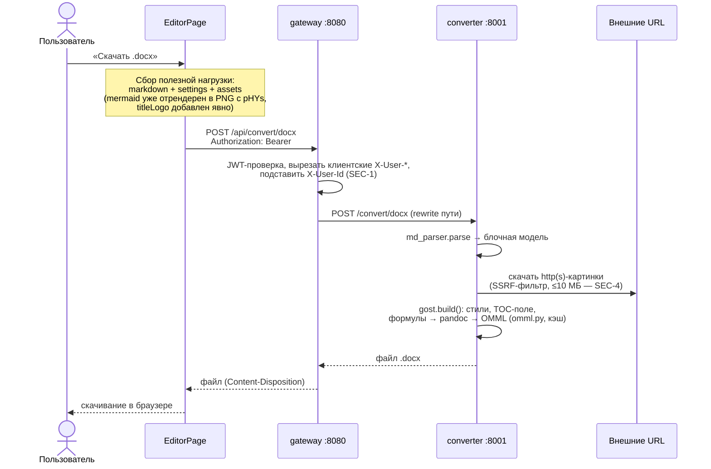

# Поток: экспорт в DOCX

Кнопка «Скачать» в шапке. Конвертация серверная (см. `overview.md`, почему
не client-side). Правила сборки документа — спеки `gost-layout.md`,
`pagination.md`, `markdown-dialect.md`.

## Что важно знать

- **Ассеты передаются явно.** Картинки не лежат в markdown — там ссылки
  `asset:<key>`, а PNG-данные идут в поле `assets`. Логотип титульника —
  ассет вне markdown, его добавляет `download()` (GL-9).
- **Каждая формула гоняется через pandoc** (`markdown→docx`, извлекается
  `<m:oMath>`) с кэшем — MD-7.
- **DOCX — единственный серверный формат экспорта.** Постраничный паритет с
  превью сверяется по DOCX, открытому в Word/LibreOffice (`pagination.md`,
  «Верификация»). Экспорт в PDF (через LibreOffice) убран 2026-07-18 —
  пользователь при необходимости сохраняет PDF из Word.
- Таймаут ответа gateway — 120 с; большие документы с десятками формул
  укладываются за счёт кэша OMML.
