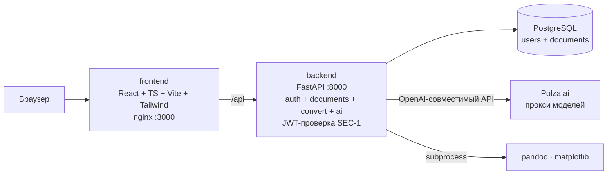

# Архитектура: обзор

Как система устроена (as-is). Что система должна делать — в `../specs/`,
почему так решили — в `../decisions/`. Ключевые сценарии по шагам — в `flows/`.

## Карта системы



## Сервисы

Бэкенд — ОДИН монолит (`services/backend`): микросервисы схлопнуты 2026-07-19
(соло-MVP, низкая нагрузка — микросервисы были лишней ценой; см. ADR-0004).

| Сервис | Стек | Порт | Назначение |
|--------|------|------|------------|
| `frontend` | React 18, TypeScript 5, Vite 5, Tailwind 3, KaTeX, Mermaid 10, Vitest 4 | 3000 (prod) / 5173 (dev) | SPA: редактор, ГОСТ-превью, консоль ИИ |
| `backend` | Python 3.12, FastAPI, SQLAlchemy 2, PyJWT, bcrypt, python-docx, Pandoc, LangChain, matplotlib | 8000 | Монолит: auth + documents + convert (MD→DOCX) + ai; JWT-проверка (SEC-1) |
| `postgres` | PostgreSQL 16-alpine | 5432 | Единая база: таблицы `users`, `documents` |

Backend — один Python-образ (`services/backend/Dockerfile`, pandoc — apt-пакетом);
тесты гоняются в нём (CLAUDE.md). Health — `GET /health`.

## Модули backend

Один FastAPI-app (`app/main.py`) монтирует роутеры по префиксам:

| Префикс | Модуль | Что делает |
|---------|--------|------------|
| `/api/auth/**` | `app/auth/` | регистрация, вход, профиль, выпуск JWT |
| `/api/convert/**` | `app/convert/` | MD → DOCX по ГОСТ (`gost.py`/`md_parser.py`/`omml.py`) |
| `/api/ai/**` | `app/ai/` | генерация/правка (спека `ai-agent.md`) |

JWT-проверка — зависимость `app/security.py:get_current_user_id` (замена
gateway, SEC-1); публичны только /register и /login. CORS (FastAPI middleware)
разрешён для `localhost:3000` и `localhost:5173`, наружу отдаётся
`Content-Disposition`. Генерация ИИ — асинхронные job (AI-4), длинных HTTP-
ответов нет.

## Данные

- PostgreSQL 16, ОДНА база и ОДНА таблица — `users` (пользователи).
- Схема создаётся при старте (`Base.metadata.create_all`, `app/db.py`);
  модели — SQLAlchemy 2 с портируемыми типами (тесты идут на SQLite).
- ДОКУМЕНТ живёт ТОЛЬКО на клиенте (решение 2026-07-19, серверный CRUD
  документов удалён): localStorage — текст, ассеты картинок (`asset:<key>`,
  data-URL отдельно от текста), настройки, JWT. Перенос между устройствами —
  экспорт/импорт .zip (markdown + картинки).

## Frontend: ключевые модули

Маршруты SPA (бренд UI — Texturn): `/` — главная-launcher (`pages/HomePage.tsx`:
лендинг, карточка «Продолжить» при черновике, три входа — ИИ/пустой/загрузка),
`/create` — страница генерации (`pages/CreatePage.tsx`, требует входа),
`/editor` — редактор (`pages/EditorPage.tsx`), `/login` — вход. Действия между
страницами передаются через `lib/handoff.ts` (одноразовый модульный «карман»:
«upload» с File — его через history state не протащить, «track» с jobId
запущенной генерации).

- `src/lib/markdown.ts` — парсер MD в блочную модель (зеркало —
  `backend/app/convert/md_parser.py`).
- `src/lib/gostRender.ts` — блоки → HTML по ГОСТ (спека `gost-layout.md`).
- `src/lib/paginate.ts` — разбиение на страницы А4 (спека `pagination.md`).
- `src/lib/highlight.ts` — overlay-подсветка редактора: `<textarea>` + слой
  `<pre>`, которые ОБЯЗАНЫ переносить строки одинаково; в стилях токенов
  допустимы ТОЛЬКО цвет/фон/border-radius — любые
  padding/margin/font-size/font-family разъезжают курсор с текстом
  (симптомы: «плывут интервалы», «правлю одну строку — меняется другая»).
  Касается и подсветки кода в ```-блоках (`hlCode`: токены собираются по
  сырой строке одним проходом с отбросом пересечений). Визуальная проверка —
  `frontend/highlight-test.html`, обе темы.
- `src/pages/EditorPage.tsx` — композиция состояния редактора: документ,
  панели, модалки; вся многошаговая логика вынесена в хуки и lib-модули ниже.
- `src/hooks/` — логика EditorPage по зонам ответственности:
  `usePagination` (дебаунс перепагинации 180 мс), `useDocPersistence`
  (автосохранение в localStorage, дебаунс 700 мс — облачного CRUD нет),
  `useAiJob` (поллинг job 700 мс, стриминг partial — AI-5, результат
  генерации/правки применяется в редактор сразу — AI-6), `useToast`, `useZoom`.
- `src/lib/aiPrompt.ts` — чистая логика точек входа ИИ: `validatePrompt`
  (ступень 1 AI-9), применение разбора analyze-prompt к опциям отчёта и
  сборка опций генерации.
- `src/pages/CreatePage.tsx` — страница «Создать с ИИ» (/create): единственная
  точка запуска генерации; запущенный job передаётся редактору через handoff
  (AI-10).
- `src/lib/docImport.ts` / `src/lib/docExport.ts` — чистая логика загрузки
  .md/.zip (кириллица в именах архива, перепривязка локальных картинок к
  asset-ключам) и экспорта .zip/.md (обратно импортируемый архив).
- `src/components/AiConsole.tsx` — консоль правок под редактором; гостю и на
  пустом документе показывает подсказку без кнопок (спека `ai-agent.md`, AI-10).
- `src/components/SiteHeader.tsx` — общая шапка страниц вне редактора (бренд,
  переключатель темы, профиль/вход); пишет тему в localStorage.
- `src/components/ui.tsx` — примитивы, в т.ч. `ModalShell` — единый каркас
  всех модалок (оверлей + панель).

Тесты фронтенда — vitest + happy-dom + @testing-library/react, лежат в
`frontend/tests/` зеркальной структурой к `src/` (`tests/lib/`,
`tests/components/`, `tests/hooks/`); общий setup — `tests/setup.ts`
(in-memory localStorage: штатного в vitest 4 + happy-dom нет). Имена тестов
содержат ID пунктов спек. Реальную раскладку страниц happy-dom не считает —
её проверяет харнесс `preview-test.html` в Chrome (см.
`docs/specs/pagination.md`).

Конвертация в DOCX — СЕРВЕРНАЯ. Client-side генерация на TS (`docx`-либа)
была опробована и отвергнута: низкое качество формул (KaTeX MathML→mml2omml);
Pandoc даёт родной OMML.

## Деплой

- Оркестрация — `docker-compose.yml`; локальные переопределения —
  `docker-compose.override.yml` (в .gitignore).
- Health checks у postgres и backend; `depends_on: service_healthy` задаёт порядок.
- Наружу открыт только фронт (`:3000`); backend `:8000` проброшен для dev-прокси
  vite и в проде закрывается override'ом.
- **Гочи**: `docker compose restart` НЕ перечитывает `.env` — нужен
  `docker compose up -d <service>`; docker-сборка иногда тихо не обновляет
  образ (кэш) — после деплоя сверять артефакт в контейнере (backend:
  grep правки в `app/convert/gost.py`; frontend: имя бандла `index-<hash>.js`
  в `dist/` против контейнера).
