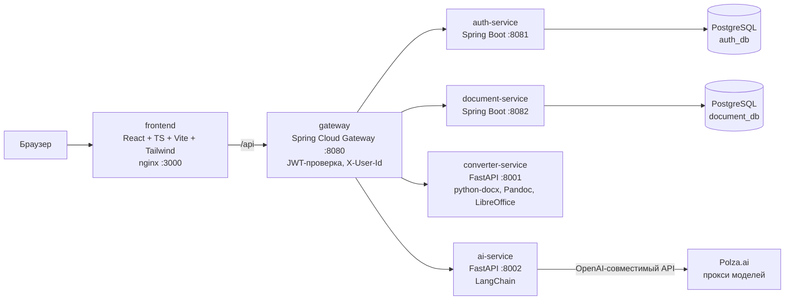

# Архитектура: обзор

Как система устроена (as-is). Что система должна делать — в `../specs/`,
почему так решили — в `../decisions/`. Ключевые сценарии по шагам — в `flows/`.

## Карта системы



## Сервисы

| Сервис | Стек | Порт | Назначение |
|--------|------|------|------------|
| `frontend` | React 18, TypeScript 5, Vite 5, Tailwind 3, KaTeX, Mermaid 10, Vitest 4 | 3000 (prod) / 5173 (dev) | SPA: редактор, ГОСТ-превью, консоль ИИ |
| `gateway` | Java 21, Spring Boot 3.4.5, Spring Cloud Gateway 2024.0.1, JJWT 0.12.6 | 8080 | Единая точка входа, JWT-валидация, `X-User-Id` (SEC-1) |
| `auth-service` | Java 21, Spring Boot, JPA, Flyway, BCrypt | 8081 | Регистрация, вход, профиль, выпуск JWT |
| `document-service` | Java 21, Spring Boot, JPA, Flyway | 8082 | CRUD документов (markdown + настройки) |
| `converter-service` | Python 3.12, FastAPI, python-docx, Pandoc, LibreOffice, poppler-utils | 8001 | MD → DOCX/PDF по ГОСТ; формулы LaTeX→OMML через Pandoc (`omml.py`); PDF через LibreOffice (`pdf.py`: Basic-макрос обновляет поле содержания, профиль-шаблон готовится при сборке образа) |
| `ai-service` | Python 3.12, FastAPI, LangChain | 8002 | Генерация/правка/нормоконтроль (спека `ai-agent.md`) |
| `postgres` | PostgreSQL 16-alpine | 5432 | Базы `auth_db`, `document_db` |

Java-сервисы собираются Gradle'ом внутри Dockerfile (локального wrapper нет);
Java-тестов в репозитории нет, health — `/actuator/health`.

## Маршрутизация gateway

Источник: `services/gateway/src/main/resources/application.yml`.

| Префикс | Сервис | Переписывание пути |
|---------|--------|--------------------|
| `/api/auth/**` | auth-service | нет (путь как есть) |
| `/api/documents/**` | document-service | нет (путь как есть) |
| `/api/convert/**` | converter-service | `/api/convert/X` → `/convert/X` |
| `/api/ai/**` | ai-service | `/api/ai/X` → `/X` |

Ответный таймаут — **120 с** (потому генерация ИИ — асинхронные job, AI-4).
CORS разрешён для `localhost:3000` и `localhost:5173`; наружу отдаётся
заголовок `Content-Disposition` (имена скачиваемых файлов).

## Данные

- PostgreSQL 16, две базы: `auth_db` (пользователи), `document_db`
  (документы: markdown + настройки JSON).
- Инициализация: `infra/postgres/init-databases.sh` →
  `/docker-entrypoint-initdb.d/`.
- Миграции — Flyway, SQL в `src/main/resources/db/migration` Java-сервисов.
- На клиенте: localStorage — текущий текст, ассеты картинок
  (`asset:<key>`, data-URL отдельно от текста), настройки, JWT.

## Frontend: ключевые модули

- `src/lib/markdown.ts` — парсер MD в блочную модель (зеркало —
  `converter/app/md_parser.py`).
- `src/lib/gostRender.ts` — блоки → HTML по ГОСТ (спека `gost-layout.md`).
- `src/lib/paginate.ts` — разбиение на страницы А4 (спека `pagination.md`).
- `src/lib/highlight.ts` — overlay-подсветка редактора: `<textarea>` + слой
  `<pre>`, которые ОБЯЗАНЫ переносить строки одинаково; в стилях токенов
  допустимы ТОЛЬКО цвет/фон/border-radius — любые
  padding/margin/font-size/font-family разъезжают курсор с текстом
  (симптомы: «плывут интервалы», «правлю одну строку — меняется другая»).
  Касается и подсветки кода в ```-блоках (`hlCode`: токены собираются по
  сырой строке одним проходом с отбросом пересечений). Визуальная проверка —
  `frontend/highlight-test.html`, обе темы.
- `src/pages/EditorPage.tsx` — состояние редактора, поллинг job'ов, история
  ИИ-правок.
- `src/components/AiConsole.tsx` — консоль ИИ (спека `ai-agent.md`).

Конвертация в DOCX — СЕРВЕРНАЯ. Client-side генерация на TS (`docx`-либа)
была опробована и отвергнута: низкое качество формул (KaTeX MathML→mml2omml);
Pandoc даёт родной OMML.

## Деплой

- Оркестрация — `docker-compose.yml`; локальные переопределения —
  `docker-compose.override.yml` (в .gitignore).
- Health checks у всех сервисов; `depends_on: service_healthy` задаёт порядок.
- Наружу открыты только 3000 (frontend) и 8080 (gateway).
- **Гочи**: `docker compose restart` НЕ перечитывает `.env` — нужен
  `docker compose up -d <service>`; docker-сборка иногда тихо не обновляет
  образ (кэш) — после деплоя сверять артефакт в контейнере (converter:
  grep правки в `app/gost.py`; frontend: имя бандла `index-<hash>.js`
  в `dist/` против контейнера).
