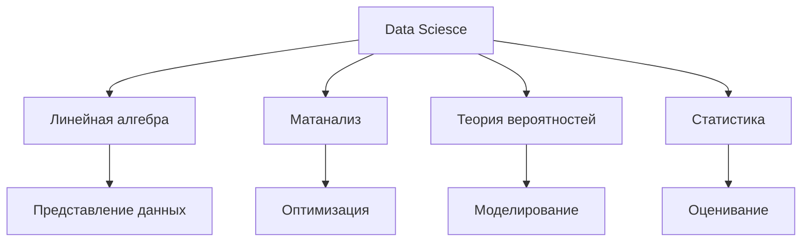
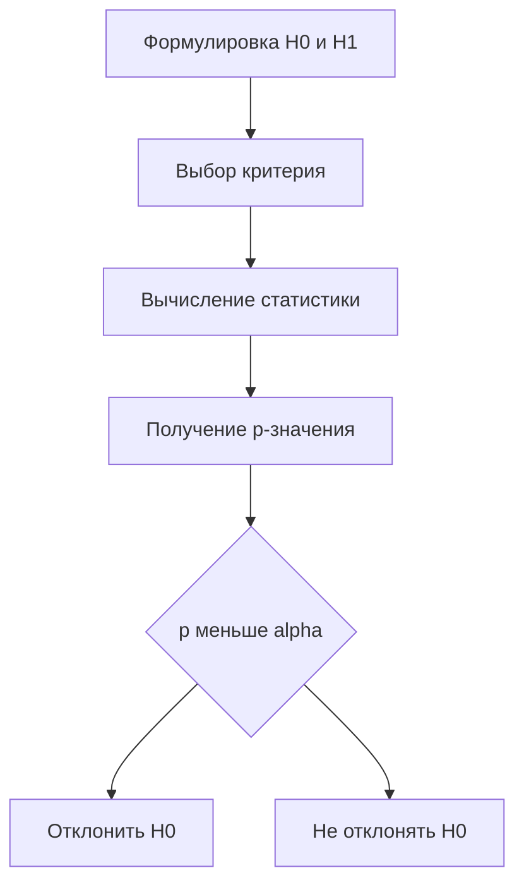
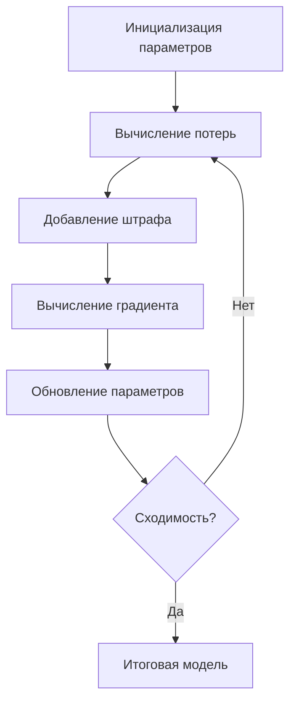

# Введение

Стремительное развитие цифровых технологий и накопление данных в промышленных, научных и социальных сферах обусловили формирование самостоятельной дисциплины — *data science*, объединяющей методы статистики, машинного обучения и вычислительной математики. Центральным фундаментом этой дисциплины является математика: именно математический аппарат определяет корректность алгоритмов, качество моделей и обоснованность выводов, получаемых в ходе анализа данных. Несмотря на широкое распространение готовых программных библиотек, глубокое понимание математических основ остаётся необходимым условием профессиональной работы специалиста в области анализа данных. В этой связи систематическое изучение роли математики в data science представляется актуальной задачей как с теоретической, так и с прикладной точки зрения.

**Цель работы** — исследовать математические основы data science, выявить роль ключевых разделов математики в построении и обучении моделей машинного обучения, а также в статистическом анализе данных.

Для достижения поставленной цели сформулированы следующие задачи:

- охарактеризовать роль математики в современном data science и определить взаимосвязь её разделов с практическими задачами анализа данных;
- рассмотреть применение линейной алгебры при представлении данных, построении нейронных сетей и методах снижения размерности;
- описать использование теории вероятностей и математической статистики для моделирования, оценивания и проверки гипотез;
- проанализировать методы оптимизации, применяемые при обучении моделей машинного обучения, включая градиентные методы и регуляризацию.

**Объект исследования** — математические методы и модели, используемые в задачах анализа данных и машинного обучения.

**Предмет исследования** — взаимосвязь разделов математики (линейной алгебры, математического анализа, теории вероятностей и методов оптимизации) с конкретными алгоритмами и подходами data science.

Работа состоит из введения, четырёх основных разделов, заключения и списка использованных источников. В первом разделе рассматриваются общие математические основы анализа данных, во втором — линейная алгебра в машинном обучении, в третьем — вероятностно-статистические методы, в четвёртом — методы оптимизации.

# Математические основы анализа данных

Data science как прикладная дисциплина опирается на строгий математический фундамент, без которого невозможно ни построение предсказательных моделей, ни корректная интерпретация результатов анализа. В настоящем разделе рассматриваются ключевые математические дисциплины, формирующие этот фундамент, и прослеживается их связь с конкретными задачами обработки данных.

## Роль математики в современном data science

Современный data science представляет собой синтез нескольких научных областей: статистики, линейной алгебры, математического анализа и теории вероятностей. Каждая из этих областей решает определённый класс задач: статистика обеспечивает инструменты для описания и обобщения данных, линейная алгебра — для их компактного представления и преобразования, математический анализ — для нахождения оптимальных параметров моделей, а теория вероятностей — для работы с неопределённостью и случайностью [1].

Без понимания математических основ специалист в области анализа данных рискует применять алгоритмы как «чёрный ящик», не осознавая ограничений и условий их корректного использования. Именно математическая грамотность позволяет выбирать подходящий метод, диагностировать ошибки модели и интерпретировать её поведение [2].

Рисунок: Взаимосвязь математических дисциплин в data science



## Линейная алгебра как основа работы с данными

Линейная алгебра является наиболее востребованным разделом математики в data science. Данные в подавляющем большинстве задач представляются в виде матриц и векторов: обучающая выборка из $n$ объектов с $d$ признаками задаётся матрицей $\mathbf{X} \in \mathbb{R}^{n \times d}$, а целевые значения — вектором $\mathbf{y} \in \mathbb{R}^{n}$ [3].

Операции умножения матриц, нахождения обратной матрицы, вычисления собственных значений и сингулярного разложения лежат в основе таких методов, как линейная регрессия, метод главных компонент (PCA) и нейронные сети. Решение задачи линейной регрессии методом наименьших квадратов выражается формулой нормального уравнения:

$$\hat{\boldsymbol{\beta}} = (\mathbf{X}^\top \mathbf{X})^{-1} \mathbf{X}^\top \mathbf{y}$$

где $\hat{\boldsymbol{\beta}}$ — вектор оценок коэффициентов регрессии; $\mathbf{X}$ — матрица признаков; $\mathbf{y}$ — вектор целевых значений; $\mathbf{X}^\top$ — транспонированная матрица признаков.

Понимание геометрической интерпретации линейных преобразований, ортогональности и проекций позволяет глубже осмыслить работу алгоритмов снижения размерности и кластеризации [4].

## Математический анализ и методы оптимизации

Математический анализ обеспечивает теоретическую базу для методов оптимизации, которые составляют основу обучения большинства моделей машинного обучения. Обучение модели сводится к минимизации функции потерь $\mathcal{L}(\boldsymbol{\theta})$ по параметрам $\boldsymbol{\theta}$. Для этого необходимо вычислять производные и градиенты, понимать условия экстремума и исследовать поведение функций [5].

Понятия непрерывности, дифференцируемости и выпуклости функций определяют, насколько эффективно и надёжно работают алгоритмы градиентного спуска. Правило дифференцирования сложной функции (*chain rule*) лежит в основе алгоритма обратного распространения ошибки в нейронных сетях. Таким образом, математический анализ напрямую определяет возможность и скорость обучения глубоких моделей [6].

## Теория вероятностей и математическая статистика

Теория вероятностей формирует язык для описания неопределённости, присущей реальным данным. Большинство алгоритмов машинного обучения — от наивного байесовского классификатора до скрытых марковских моделей — строятся на вероятностных предположениях о природе данных [7].

Математическая статистика, в свою очередь, предоставляет инструменты для оценки параметров распределений, проверки статистических гипотез и построения доверительных интервалов. Эти инструменты необходимы как при разведочном анализе данных, так и при валидации обученных моделей.

Таблица: Ключевые математические дисциплины и их применение в data science

| Дисциплина | Основные понятия | Применение в DS |
|---|---|---|
| Линейная алгебра | Матрицы, векторы, SVD | Регрессия, PCA, нейросети |
| Математический анализ | Производная, градиент | Оптимизация, backprop |
| Теория вероятностей | Распределения, случайные величины | Байесовские модели |
| Математическая статистика | Оценки, гипотезы | Валидация, A/B-тесты |

Рисунок: Частота применения математических дисциплин в задачах data science


Таким образом, четыре рассмотренные математические дисциплины образуют взаимосвязанную систему знаний, без которой невозможно ни понимание существующих алгоритмов, ни разработка новых подходов к анализу данных. Каждая из них вносит незаменимый вклад в методологический арсенал специалиста по data science [8].

# Линейная алгебра в машинном обучении

Линейная алгебра занимает центральное место среди математических дисциплин, применяемых в машинном обучении. Операции над векторами и матрицами лежат в основе представления данных, вычисления прогнозов, обучения нейронных сетей и снижения размерности. Понимание линейно-алгебраических структур позволяет не только грамотно реализовывать алгоритмы, но и анализировать их вычислительную сложность и численную устойчивость [1].

## Векторные пространства и представление данных

В задачах анализа данных каждый объект выборки принято представлять в виде вектора признаков $ \mathbf{x} \in \mathbb{R}^n $, где $ n $ — число измеримых характеристик объекта. Совокупность таких векторов образует матрицу данных $ X \in \mathbb{R}^{m \times n} $, где $ m $ — количество наблюдений. Подобное представление унифицирует разнородные данные: текстовые документы кодируются через TF-IDF или эмбеддинги, изображения — через пиксельные матрицы или карты признаков свёрточных сетей, категориальные переменные — через one-hot-кодирование.

Понятие **линейной зависимости** и **ранга матрицы** непосредственно связано с информативностью признаков: если столбцы матрицы $ X $ линейно зависимы, часть признаков является избыточной, что ухудшает обусловленность задачи и может привести к численной нестабильности при обращении матриц. Метрические свойства векторного пространства — нормы и скалярные произведения — используются при вычислении расстояний между объектами, что критично для алгоритмов кластеризации и метода ближайших соседей [2].

Таблица: Основные операции линейной алгебры и их роль в машинном обучении

| Операция | Обозначение | Применение в ML |
|---|---|---|
| Скалярное произведение | $ \mathbf{a}^\top \mathbf{b} $ | Линейные классификаторы, ядра |
| Матричное умножение | $ AB $ | Прямой проход нейросети |
| Транспонирование | $ A^\top $ | Вычисление градиентов |
| Обращение матрицы | $ A^{-1} $ | МНК, нормальные уравнения |
| Сингулярное разложение | $ U \Sigma V^\top $ | PCA, рекомендательные системы |

## Матричные операции в нейронных сетях

Нейронная сеть с прямым распространением сигнала может быть описана как последовательность аффинных преобразований, перемежаемых нелинейными функциями активации. Для одного слоя преобразование записывается следующим образом:

$$
\mathbf{h}^{(l)} = \sigma\!\left(W^{(l)}\,\mathbf{h}^{(l-1)} + \mathbf{b}^{(l)}\right),
$$

где $ W^{(l)} \in \mathbb{R}^{d_l \times d_{l-1}} $ — матрица весов $ l $-го слоя, $ \mathbf{b}^{(l)} \in \mathbb{R}^{d_l} $ — вектор смещений, $ \sigma $ — поэлементная функция активации, $ \mathbf{h}^{(l-1)} $ — вектор активаций предыдущего слоя.

При обработке мини-батча из $ B $ примеров входные данные объединяются в матрицу $ H^{(l-1)} \in \mathbb{R}^{d_{l-1} \times B} $, и весь прямой проход сводится к серии матричных умножений, эффективно реализуемых на GPU благодаря высокой степени параллелизма. Алгоритм обратного распространения ошибки также формулируется через матричные операции: градиент по весам вычисляется как внешнее произведение векторов активаций и ошибок, а передача градиента на предыдущий слой — через умножение на транспонированную матрицу весов [3].

Рисунок: Прямой проход двухслойной нейронной сети


## Метод главных компонент и сингулярное разложение

**Метод главных компонент** (PCA) является одним из наиболее распространённых инструментов снижения размерности и основан на вычислении собственных векторов матрицы ковариаций данных. Математически PCA сводится к **сингулярному разложению** (SVD) центрированной матрицы данных:

$$
X = U \Sigma V^\top,
$$

где $ U \in \mathbb{R}^{m \times m} $ — матрица левых сингулярных векторов, $ \Sigma \in \mathbb{R}^{m \times n} $ — диагональная матрица сингулярных чисел, $ V \in \mathbb{R}^{n \times n} $ — матрица правых сингулярных векторов (главных направлений).

Проекция данных на первые $ k $ главных компонент позволяет сохранить максимальную долю дисперсии при минимальном числе измерений. Усечённое SVD широко применяется также в рекомендательных системах для факторизации матриц взаимодействий пользователь–товар и в обработке естественного языка при построении латентно-семантических представлений [4].

Рисунок: Доля объяснённой дисперсии по главным компонентам


Таким образом, линейная алгебра пронизывает все ключевые этапы работы с данными: от их структурированного представления и эффективных вычислений в нейронных сетях до компактного описания данных посредством разложений матриц. Глубокое владение этим аппаратом является необходимым условием для разработки и анализа современных алгоритмов машинного обучения [1].

# Теория вероятностей и статистические методы в data science

Теория вероятностей и математическая статистика образуют неотъемлемую часть методологического арсенала data science. Именно эти дисциплины обеспечивают формальный язык для описания неопределённости, построения вероятностных моделей и проверки статистических гипотез. Без вероятностного подхода невозможно корректно интерпретировать результаты анализа, оценивать качество моделей и делать обоснованные выводы на основе выборочных данных [1].

## Вероятностные распределения и их применение

Вероятностное распределение задаёт закон, по которому случайная величина принимает те или иные значения. В задачах data science распределения используются для моделирования шума в данных, описания целевых переменных и формулировки предположений о природе наблюдений.

Среди непрерывных распределений ключевую роль играет **нормальное распределение**, плотность вероятности которого определяется выражением:

$$
f(x \mid \mu, \sigma^2) = \frac{1}{\sqrt{2\pi\sigma^2}} \exp\!\left(-\frac{(x - \mu)^2}{2\sigma^2}\right),
$$

где $\mu$ — математическое ожидание, $\sigma^2$ — дисперсия случайной величины.

Нормальное распределение лежит в основе линейной регрессии, анализа остатков и многих статистических критериев. Для моделирования счётных данных применяется распределение Пуассона, для бинарных исходов — распределение Бернулли и биномиальное распределение. В задачах, связанных с временем ожидания событий, используется показательное распределение.

Таблица: Основные вероятностные распределения и области их применения в data science

| Распределение | Тип | Параметры | Применение |
|---|---|---|---|
| Нормальное | Непрерывное | $\mu$, $\sigma^2$ | Регрессия, анализ остатков |
| Биномиальное | Дискретное | $n$, $p$ | Классификация, A/B-тесты |
| Пуассона | Дискретное | $\lambda$ | Моделирование потоков событий |
| Показательное | Непрерывное | $\lambda$ | Анализ времени до отказа |
| Бета | Непрерывное | $\alpha$, $\beta$ | Байесовские модели, CTR |

Рисунок: Плотности нормального распределения при различных параметрах


## Байесовский подход к анализу данных

**Байесовский подход** представляет собой альтернативу классической (частотной) статистике и основывается на теореме Байеса:

$$
P(\theta \mid X) = \frac{P(X \mid \theta)\, P(\theta)}{P(X)},
$$

где $\theta$ — параметры модели, $X$ — наблюдаемые данные, $P(\theta)$ — априорное распределение, $P(X \mid \theta)$ — функция правдоподобия, $P(\theta \mid X)$ — апостериорное распределение.

Байесовский подход позволяет включать в модель предварительные знания о параметрах через априорное распределение и обновлять их по мере поступления новых данных. В data science он применяется в задачах классификации (наивный байесовский классификатор), построения вероятностных графических моделей, а также при работе с малыми выборками, где частотные методы дают нестабильные оценки [2]. Байесовские методы также лежат в основе современных подходов к настройке гиперпараметров моделей — байесовской оптимизации.

## Статистическое оценивание и проверка гипотез

Статистическое оценивание решает задачу восстановления неизвестных параметров генеральной совокупности по выборочным данным. Различают точечные оценки (например, выборочное среднее и выборочная дисперсия) и интервальные оценки — **доверительные интервалы**, задающие диапазон значений, в котором истинный параметр находится с заданной вероятностью.

Проверка статистических гипотез является стандартным инструментом при сравнении моделей, анализе A/B-экспериментов и оценке значимости признаков. Процедура включает формулировку нулевой гипотезы $H_0$ и альтернативной $H_1$, выбор критерия (t-критерий, критерий хи-квадрат, F-критерий), вычисление p-значения и принятие решения на основе уровня значимости $\alpha$. Ошибки первого рода (ложное отклонение $H_0$) и второго рода (ложное принятие $H_0$) определяют компромисс между чувствительностью и специфичностью статистического вывода [3].

Рисунок: Схема процедуры проверки статистической гипотезы



## Регрессионный анализ и корреляция

**Регрессионный анализ** изучает зависимость целевой переменной от одного или нескольких предикторов. Линейная регрессия является базовой моделью, параметры которой оцениваются методом наименьших квадратов. Множественная регрессия обобщает этот подход на случай нескольких объясняющих переменных и широко используется в прогнозировании, анализе временных рядов и интерпретации влияния факторов [4].

Корреляционный анализ позволяет измерить степень линейной связи между переменными. Коэффициент корреляции Пирсона принимает значения от $-1$ до $1$: значения, близкие к $\pm 1$, свидетельствуют о сильной линейной зависимости, значение, близкое к нулю, — об её отсутствии. Для порядковых данных применяется коэффициент ранговой корреляции Спирмена. Важно учитывать, что корреляция не означает причинно-следственной связи — данное разграничение критически важно при интерпретации результатов в прикладных задачах data science [5].

# Методы оптимизации в задачах машинного обучения

Обучение моделей машинного обучения сводится к задаче минимизации функции потерь — числовой меры расхождения между предсказаниями модели и истинными значениями целевой переменной. Решение этой задачи требует применения математических методов оптимизации, которые обеспечивают нахождение параметров модели, минимизирующих выбранный критерий качества. В настоящем разделе рассматриваются основные подходы к оптимизации, используемые в data science: градиентные методы, теория выпуклой оптимизации и регуляризация.

## Градиентный спуск и его модификации

Градиентный спуск является базовым итерационным алгоритмом минимизации дифференцируемых функций. Идея метода состоит в последовательном обновлении параметров модели в направлении, противоположном градиенту функции потерь. Правило обновления параметров записывается следующим образом:

$$
\theta_{t+1} = \theta_t - \eta \nabla_\theta \mathcal{L}(\theta_t)
$$

где $\theta_t$ — вектор параметров на шаге $t$; $\eta > 0$ — скорость обучения (*learning rate*); $\nabla_\theta \mathcal{L}(\theta_t)$ — градиент функции потерь по параметрам в точке $\theta_t$.

Классический (пакетный) градиентный спуск вычисляет градиент по всей обучающей выборке, что обеспечивает точность оценки, но требует значительных вычислительных ресурсов при большом объёме данных. В практических задачах применяются модификации, снижающие вычислительную нагрузку и ускоряющие сходимость [1].

**Стохастический градиентный спуск** (SGD) обновляет параметры на основе градиента, вычисленного по одному случайно выбранному объекту. Это вносит шум в траекторию оптимизации, однако позволяет обрабатывать данные потоково и нередко помогает избежать локальных минимумов. **Мини-пакетный градиентный спуск** представляет собой компромисс: градиент вычисляется по небольшому подмножеству (мини-пакету) объектов, что сочетает вычислительную эффективность с достаточной точностью оценки.

Среди адаптивных методов особое место занимают алгоритмы **Adam**, **RMSProp** и **Adagrad**, которые автоматически подстраивают скорость обучения для каждого параметра на основе накопленной истории градиентов [2]. Алгоритм Adam сочетает оценку первого и второго моментов градиента, что обеспечивает быструю и устойчивую сходимость в большинстве задач глубокого обучения.

Рисунок: Сравнение скорости убывания функции потерь для различных методов оптимизации


## Выпуклая оптимизация и условия сходимости

Теория выпуклой оптимизации составляет теоретическую основу анализа сходимости алгоритмов обучения. Функция $f: \mathbb{R}^n \to \mathbb{R}$ называется **выпуклой**, если для любых $x, y \in \mathbb{R}^n$ и $\lambda \in [0,1]$ выполняется неравенство $f(\lambda x + (1-\lambda)y) \leq \lambda f(x) + (1-\lambda)f(y)$. Для выпуклых функций любой локальный минимум является глобальным, что гарантирует корректность градиентных методов [3].

Скорость сходимости градиентного спуска определяется свойствами функции потерь. Для $L$-гладких выпуклых функций (с ограниченной нормой гессиана) градиентный спуск с шагом $\eta = 1/L$ сходится со скоростью $O(1/t)$. Для **сильно выпуклых** функций скорость сходимости улучшается до линейной — $O(\rho^t)$, где $\rho < 1$ [4]. На практике функции потерь нейронных сетей не являются выпуклыми, однако результаты теории выпуклой оптимизации служат ориентиром при выборе гиперпараметров и анализе поведения алгоритмов.

Таблица: Сравнительная характеристика методов градиентной оптимизации

| Метод | Размер пакета | Адаптивный шаг | Сходимость | Применение |
|---|---|---|---|---|
| Пакетный GD | Вся выборка | Нет | Высокая (выпуклые) | Малые датасеты |
| SGD | 1 объект | Нет | Нестабильная | Потоковые данные |
| Mini-batch GD | 32–512 | Нет | Средняя | Нейронные сети |
| Adam | 32–512 | Да | Высокая | Глубокое обучение |
| RMSProp | 32–512 | Да | Высокая | Рекуррентные сети |

## Регуляризация как инструмент борьбы с переобучением

**Переобучение** возникает, когда модель чрезмерно подстраивается под обучающую выборку и теряет способность к обобщению на новых данных. Математически эта проблема решается введением регуляризирующего члена в функцию потерь, штрафующего за сложность модели [5].

При **L2-регуляризации** (регрессия Риджа) к функции потерь добавляется квадратичный штраф:

$$
\mathcal{L}_{\text{reg}}(\theta) = \mathcal{L}(\theta) + \lambda \|\theta\|_2^2
$$

где $\lambda > 0$ — коэффициент регуляризации; $\|\theta\|_2^2 = \sum_i \theta_i^2$ — квадрат евклидовой нормы вектора параметров.

**L1-регуляризация** (Lasso) использует норму $\|\theta\|_1 = \sum_i |\theta_i|$, что приводит к разреженным решениям: часть параметров обращается в ноль, тем самым осуществляется автоматический отбор признаков [6]. **Elastic Net** объединяет оба штрафа, обеспечивая баланс между разреженностью и устойчивостью.

Рисунок: Схема процесса оптимизации с регуляризацией



Выбор коэффициента $\lambda$ осуществляется посредством кросс-валидации: слишком малое значение не устраняет переобучение, тогда как слишком большое приводит к недообучению. Таким образом, регуляризация представляет собой не только математический инструмент, но и элемент управления компромиссом между смещением и дисперсией модели — фундаментальной проблемой статистического обучения [7].

В совокупности рассмотренные методы оптимизации — градиентные алгоритмы, теория выпуклости и регуляризация — образуют математический инструментарий, без которого невозможно эффективное обучение современных моделей машинного обучения.

# Заключение

В настоящей работе проведено комплексное исследование математических основ data science, охватывающее ключевые разделы математики, применяемые при построении и обучении моделей машинного обучения, анализе данных и интерпретации результатов.

В ходе выполнения поставленных задач было установлено следующее.

1. Математика является системообразующим фундаментом data science: линейная алгебра, математический анализ, теория вероятностей и методы оптимизации в совокупности определяют корректность алгоритмов и обоснованность получаемых выводов.

2. Линейная алгебра обеспечивает формальный язык для представления данных в виде векторов и матриц, реализации операций в нейронных сетях, а также снижения размерности посредством метода главных компонент и сингулярного разложения.

3. Теория вероятностей и математическая статистика предоставляют инструментарий для описания неопределённости, построения вероятностных моделей, байесовского вывода, проверки гипотез и регрессионного анализа, без которых невозможна корректная интерпретация результатов.

4. Методы оптимизации, прежде всего градиентный спуск и его модификации, обеспечивают практическую реализацию обучения моделей; выпуклая оптимизация гарантирует теоретические условия сходимости, а регуляризация позволяет контролировать сложность модели и предотвращать переобучение.

Таким образом, поставленная цель — систематизация и анализ математических методов, составляющих основу data science, — достигнута в полном объёме. Перспективами дальнейшего изучения темы являются исследование математических основ глубокого обучения, топологического анализа данных, а также методов оптимизации второго порядка, приобретающих всё большее значение в современной практике машинного обучения.

# Приложение А. Листинг кода

**Листинг А.1** — Реализация метода главных компонент (PCA) с использованием сингулярного разложения матрицы данных.

```python
import numpy as np


def pca(X: np.ndarray, n_components: int) -> tuple[np.ndarray, np.ndarray, np.ndarray]:
    """
    Метод главных компонент на основе SVD.

    Параметры
    ----------
    X : np.ndarray, форма (n_samples, n_features)
        Исходная матрица данных.
    n_components : int
        Число главных компонент для сохранения.

    Возвращает
    ----------
    X_reduced : np.ndarray, форма (n_samples, n_components)
        Проекция данных на главные компоненты.
    components : np.ndarray, форма (n_components, n_features)
        Главные компоненты (правые сингулярные векторы).
    explained_variance_ratio : np.ndarray, форма (n_components,)
        Доля объяснённой дисперсии каждой компоненты.
    """
    # Центрирование данных
    X_centered = X - X.mean(axis=0)

    # Сингулярное разложение: X = U * S * V^T
    U, S, Vt = np.linalg.svd(X_centered, full_matrices=False)

    # Дисперсия, объясняемая каждой компонентой
    total_variance = np.sum(S ** 2)
    explained_variance_ratio = (S ** 2) / total_variance

    # Проекция на первые n_components компонент
    components = Vt[:n_components]
    X_reduced = X_centered @ components.T

    return X_reduced, components, explained_variance_ratio[:n_components]


# Демонстрация на синтетических данных
if __name__ == "__main__":
    rng = np.random.default_rng(42)
    # Генерация данных: 200 наблюдений, 5 признаков
    X_demo = rng.standard_normal((200, 5))
    # Введение корреляции между признаками
    X_demo[:, 1] = X_demo[:, 0] * 0.9 + rng.standard_normal(200) * 0.1
    X_demo[:, 3] = X_demo[:, 2] * 0.7 + rng.standard_normal(200) * 0.3

    X_red, comps, evr = pca(X_demo, n_components=2)

    print("Форма сжатой матрицы:", X_red.shape)
    print("Доля объяснённой дисперсии по компонентам:", np.round(evr, 4))
    print("Суммарная объяснённая дисперсия:", round(float(evr.sum()), 4))
```

**Листинг А.2** — Реализация стохастического градиентного спуска (SGD) с импульсом для минимизации функции потерь линейной регрессии.

```python
import numpy as np


def mse_loss(X: np.ndarray, y: np.ndarray, w: np.ndarray) -> float:
    """Среднеквадратичная ошибка."""
    residuals = X @ w - y
    return float(np.mean(residuals ** 2))


def mse_gradient(X_batch: np.ndarray, y_batch: np.ndarray, w: np.ndarray) -> np.ndarray:
    """Градиент MSE по параметрам w на мини-батче."""
    n = X_batch.shape[0]
    residuals = X_batch @ w - y_batch
    return (2 / n) * (X_batch.T @ residuals)


def sgd_with_momentum(
    X: np.ndarray,
    y: np.ndarray,
    lr: float = 0.01,
    momentum: float = 0.9,
    batch_size: int = 32,
    n_epochs: int = 100,
    lambda_reg: float = 0.001,
    seed: int = 0,
) -> tuple[np.ndarray, list[float]]:
    """
    SGD с импульсом и L2-регуляризацией для линейной регрессии.

    Параметры
    ----------
    X : np.ndarray, форма (n_samples, n_features)
        Матрица признаков (с добавленным столбцом единиц для смещения).
    y : np.ndarray, форма (n_samples,)
        Вектор целевых значений.
    lr : float
        Скорость обучения.
    momentum : float
        Коэффициент импульса (0 — чистый SGD).
    batch_size : int
        Размер мини-батча.
    n_epochs : int
        Число эпох обучения.
    lambda_reg : float
        Коэффициент L2-регуляризации.
    seed : int
        Начальное значение генератора случайных чисел.

    Возвращает
    ----------
    w : np.ndarray
        Оптимизированный вектор параметров.
    loss_history : list[float]
        История значений функции потерь по эпохам.
    """
    rng = np.random.default_rng(seed)
    n_samples, n_features = X.shape
    w = rng.standard_normal(n_features) * 0.01
    velocity = np.zeros(n_features)
    loss_history: list[float] = []

    for epoch in range(n_epochs):
        # Перемешивание данных в начале каждой эпохи
        indices = rng.permutation(n_samples)
        X_shuffled, y_shuffled = X[indices], y[indices]

        for start in range(0, n_samples, batch_size):
            end = min(start + batch_size, n_samples)
            X_batch = X_shuffled[start:end]
            y_batch = y_shuffled[start:end]

            grad = mse_gradient(X_batch, y_batch, w)
            # Добавление градиента L2-регуляризации (смещение не регуляризуется)
            grad[:-1] += 2 * lambda_reg * w[:-1]

            # Обновление скорости и параметров
            velocity = momentum * velocity - lr * grad
            w = w + velocity

        epoch_loss = mse_loss(X, y, w)
        loss_history.append(epoch_loss)

    return w, loss_history


# Демонстрация на синтетических данных
if __name__ == "__main__":
    rng = np.random.default_rng(7)
    n, d = 500, 4
    true_w = np.array([2.5, -1.3, 0.8, 3.1, 0.5])  # последний — смещение
    X_raw = rng.standard_normal((n, d))
    X_aug = np.hstack([X_raw, np.ones((n, 1))])     # добавление столбца единиц
    y_data = X_aug @ true_w + rng.standard_normal(n) * 0.5

    w_opt, losses = sgd_with_momentum(
        X_aug, y_data, lr=0.05, momentum=0.9,
        batch_size=64, n_epochs=200, lambda_reg=0.001
    )

    print("Истинные параметры:    ", np.round(true_w, 3))
    print("Найденные параметры:   ", np.round(w_opt, 3))
    print(f"Финальная MSE: {losses[-1]:.6f}")
```

**Листинг А.3** — Реализация наивного байесовского классификатора для дискретных признаков (модель Бернулли).

```python
import numpy as np


class BernoulliBayesClassifier:
    """
    Наивный байесовский классификатор (модель Бернулли).

    Предполагает, что каждый признак является бинарным (0 или 1).
    Использует сглаживание Лапласа для устранения нулевых вероятностей.
    """

    def __init__(self, alpha: float = 1.0) -> None:
        """
        Параметры
        ----------
        alpha : float
            Параметр сглаживания Лапласа (alpha=1 — стандартное сглаживание).
        """
        self.alpha = alpha
        self.classes_: np.ndarray | None = None
        self.log_prior_: np.ndarray | None = None
        self.log_likelihood_: np.ndarray | None = None

    def fit(self, X: np.ndarray, y: np.ndarray) -> "BernoulliBayesClassifier":
        """
        Обучение классификатора.

        Параметры
        ----------
        X : np.ndarray, форма (n_samples, n_features)
            Бинарная матрица признаков.
        y : np.ndarray, форма (n_samples,)
            Вектор меток классов.
        """
        self.classes_ = np.unique(y)
        n_classes = len(self.classes_)
        n_features = X.shape[1]

        log_prior = np.zeros(n_classes)
        # log P(x_j=1 | c) и log P(x_j=0 | c) для каждого класса
        log_prob_1 = np.zeros((n_classes, n_features))
        log_prob_0 = np.zeros((n_classes, n_features))

        for idx, cls in enumerate(self.classes_):
            X_cls = X[y == cls]
            n_cls = X_cls.shape[0]

            # Логарифм априорной вероятности класса
            log_prior[idx] = np.log(n_cls / len(y))

            # Оценка вероятностей признаков со сглаживанием Лапласа
            feature_counts = X_cls.sum(axis=0)
            p1 = (feature_counts + self.alpha) / (n_cls + 2 * self.alpha)
            log_prob_1[idx] = np.log(p1)
            log_prob_0[idx] = np.log(1.0 - p1)

        self.log_prior_ = log_prior
        # Сохраняем разность log P(1|c) - log P(0|c) и сумму log P(0|c)
        self.log_likelihood_ = (log_prob_1, log_prob_0)
        return self

    def predict_log_proba(self, X: np.ndarray) -> np.ndarray:
        """
        Логарифм апостериорной вероятности для каждого класса.

        Возвращает np.ndarray формы (n_samples, n_classes).
        """
        log_prob_1, log_prob_0 = self.log_likelihood_
        # Для каждого объекта: сумма log P(x_j | c) по всем признакам
        # log P(x|c) = sum_j [ x_j * log p1_j + (1-x_j) * log p0_j ]
        log_posterior = (
            X @ log_prob_1.T + (1 - X) @ log_prob_0.T + self.log_prior_
        )
        return log_posterior

    def predict(self, X: np.ndarray) -> np.ndarray:
        """Предсказание меток классов."""
        log_posterior = self.predict_log_proba(X)
        return self.classes_[np.argmax(log_posterior, axis=1)]

    def score(self, X: np.ndarray, y: np.ndarray) -> float:
        """Доля правильно классифицированных объектов."""
        return float(np.mean(self.predict(X) == y))


# Демонстрация на синтетических бинарных данных
if __name__ == "__main__":
    rng = np.random.default_rng(21)
    n_train, n_test, n_features = 800, 200, 20

    # Класс 0: признаки активны с вероятностью 0.3
    # Класс 1: признаки активны с вероятностью 0.7
    X0 = rng.binomial(1, 0.3, (n_train // 2, n_features))
    X1 = rng.binomial(1, 0.7, (n_train // 2, n_features))
    X_train = np.vstack([X0, X1])
    y_train = np.array([0] * (n_train // 2) + [1] * (n_train // 2))

    X0t = rng.binomial(1, 0.3, (n_test // 2, n_features))
    X1t = rng.binomial(1, 0.7, (n_test // 2, n_features))
    X_test = np.vstack([X0t, X1t])
    y_test = np.array([0] * (n_test // 2) + [1] * (n_test // 2))

    clf = BernoulliBayesClassifier(alpha=1.0)
    clf.fit(X_train, y_train)
    accuracy = clf.score(X_test, y_test)
    print(f"Точность на тестовой выборке: {accuracy:.4f}")
```

