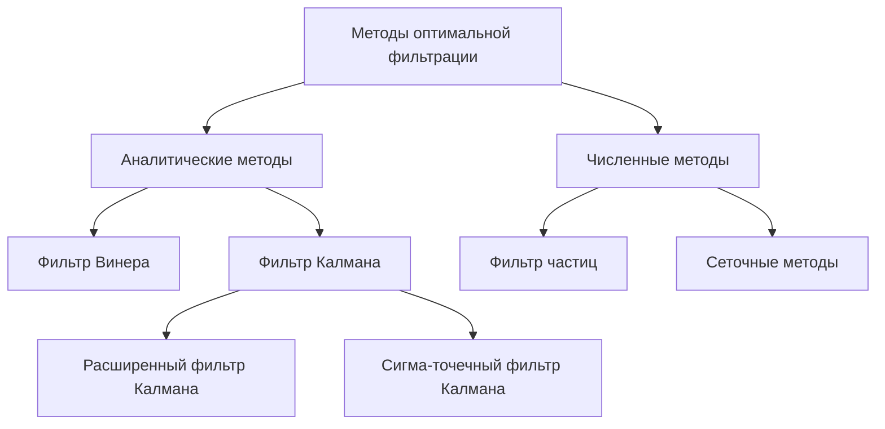
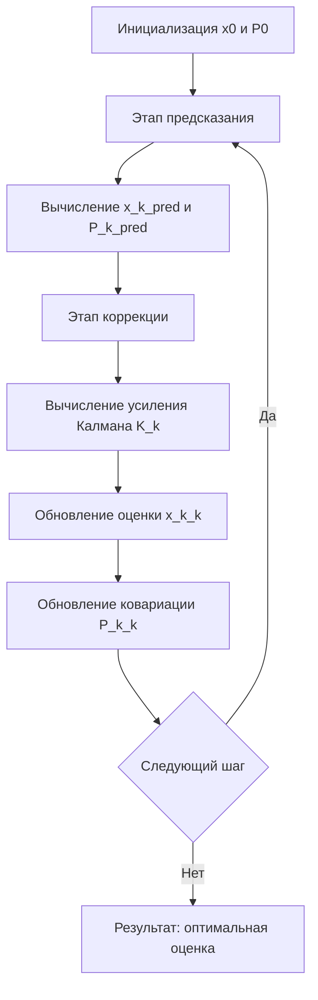
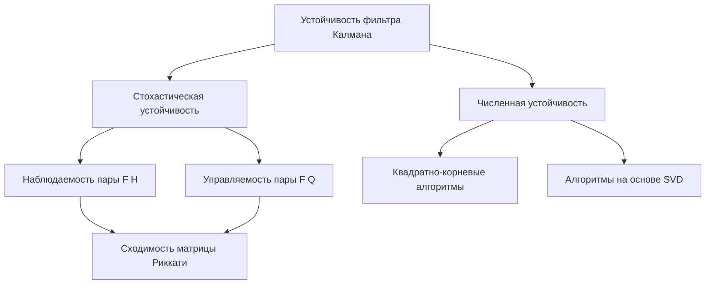
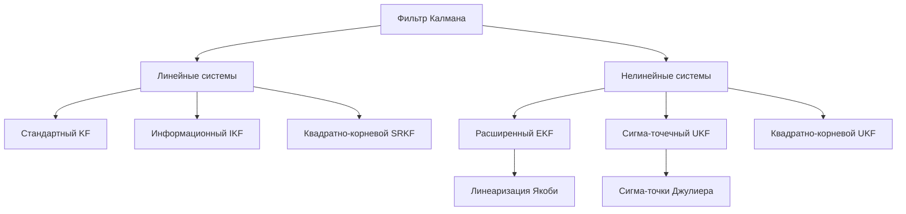
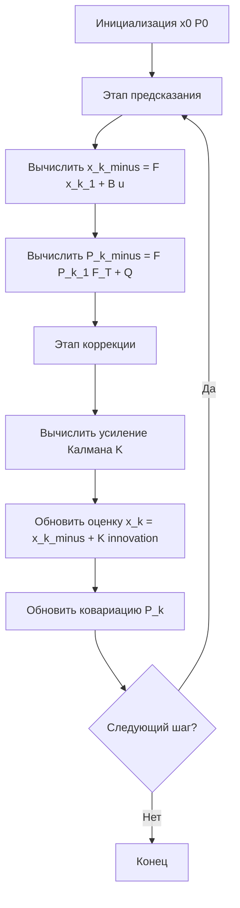

# Введение

Задача оценивания состояния динамических систем по зашумлённым измерениям занимает центральное место в теории управления, навигации, обработке сигналов и многих других областях науки и техники. В условиях неизбежного присутствия случайных возмущений как в самой системе, так и в канале измерений, получение достоверной информации о текущем состоянии объекта представляет собой нетривиальную задачу, требующую применения строгого математического аппарата.

Фильтр Калмана, разработанный Рудольфом Эмилем Калманом и опубликованный в 1960 году [1], стал одним из наиболее значимых достижений прикладной математики XX века. Алгоритм предоставляет рекуррентную процедуру оптимального линейного оценивания состояния линейных стохастических систем в условиях гауссовского белого шума, минимизируя среднеквадратическую ошибку оценки. Принципиальным преимуществом фильтра перед классическими методами, такими как метод наименьших квадратов Гаусса или фильтр Винера, является его рекуррентная структура: алгоритм не требует хранения всей предыстории наблюдений и допускает реализацию в режиме реального времени.

*Актуальность* исследования обусловлена широким спектром практических приложений фильтра Калмана. Он применяется в инерциальных навигационных системах и системах GPS-навигации, в задачах сопровождения целей в радиолокации, в робототехнике и автономных транспортных средствах, в финансовом моделировании и прогнозировании временных рядов, в обработке медицинских сигналов и геофизических данных [2, 3]. Стремительное развитие встраиваемых вычислительных систем, беспилотных летательных аппаратов и интернета вещей создаёт постоянно растущий спрос на эффективные алгоритмы оценивания состояния, что делает изучение теоретических основ и практических аспектов фильтра Калмана особенно востребованным.

**Цель работы** — исследование теоретических основ, математического аппарата, свойств и практических аспектов применения оптимального фильтра Калмана.

Для достижения поставленной цели в работе решаются следующие задачи:

- рассмотреть постановку задачи оптимальной фильтрации и проанализировать критерии оптимальности фильтров, определив место фильтра Калмана среди существующих методов оценивания состояния динамических систем;
- изучить математическую модель фильтра Калмана, включая уравнения предсказания и коррекции, матрицу ковариации ошибки оценивания и уравнение Риккати, а также условия оптимальности и сходимости алгоритма;
- проанализировать основные свойства и характеристики фильтра Калмана: несмещённость и эффективность оценок, устойчивость и численные свойства, влияние неточности задания шумовых характеристик;
- рассмотреть расширения и модификации фильтра Калмана, предназначенные для нелинейных систем и обеспечивающие повышенную численную устойчивость;
- реализовать алгоритм фильтра Калмана программно и продемонстрировать его работу на примере задачи оценивания траектории движущегося объекта с последующим анализом точности фильтрации.

**Объектом исследования** является оптимальный фильтр Калмана как алгоритм рекуррентного оценивания состояния стохастических динамических систем.

**Предметом исследования** выступают математические основы, свойства, модификации и методы практической реализации фильтра Калмана.

В работе использованы методы теории вероятностей и математической статистики, линейной алгебры, теории оптимального управления и численных методов. Практическая часть выполнена с применением языка программирования Python и соответствующих библиотек численных вычислений.

Структура работы включает введение, пять основных разделов, заключение и список использованных источников.

# Теоретические основы оптимальной фильтрации

## Задача оптимальной фильтрации и её постановка

Задача оптимальной фильтрации состоит в нахождении наилучшей оценки вектора состояния динамической системы на основе последовательности зашумлённых наблюдений. В общем виде рассматривается система, эволюция которой описывается стохастическим дифференциальным уравнением, а измерения содержат случайную составляющую, не зависящую от полезного сигнала [1].

Формально задача формулируется следующим образом. Пусть имеется динамическая система с вектором состояния $ \mathbf{x}_k \in \mathbb{R}^n $ и вектором наблюдений $ \mathbf{z}_k \in \mathbb{R}^m $. Требуется построить оценку $ \hat{\mathbf{x}}_{k|k} $, минимизирующую некоторый функционал качества, опираясь на всю доступную к моменту времени $ k $ историю наблюдений $ \mathbf{Z}_k = \{\mathbf{z}_1, \mathbf{z}_2, \ldots, \mathbf{z}_k\} $.

Общая постановка предполагает задание:

- модели динамики системы с шумом процесса;
- модели измерений с шумом наблюдений;
- начального распределения вектора состояния;
- критерия оптимальности оценки.

Центральным результатом байесовского подхода к фильтрации является рекуррентное вычисление апостериорного распределения $ p(\mathbf{x}_k | \mathbf{Z}_k) $, которое полностью характеризует состояние системы с учётом всех поступивших измерений [2].

## Критерии оптимальности фильтров

Выбор критерия оптимальности определяет структуру и свойства получаемого фильтра. Наиболее распространёнными критериями являются следующие.

**Минимум среднеквадратической ошибки** (MMSE) предполагает минимизацию математического ожидания квадрата нормы ошибки оценивания:

$$
J = \mathbb{E}\left[\|\mathbf{x}_k - \hat{\mathbf{x}}_k\|^2\right]
$$

где $ \mathbf{x}_k $ — истинное состояние системы, $ \hat{\mathbf{x}}_k $ — его оценка, $ \mathbb{E}[\cdot] $ — оператор математического ожидания.

При гауссовских шумах оценка MMSE совпадает с условным математическим ожиданием $ \hat{\mathbf{x}}_k = \mathbb{E}[\mathbf{x}_k | \mathbf{Z}_k] $, что является теоретическим обоснованием фильтра Калмана [3].

Помимо критерия MMSE, в теории фильтрации применяются критерий максимума апостериорной вероятности (MAP), критерий минимума максимальной ошибки (минимаксный) и критерий максимального правдоподобия. Каждый из них приводит к различным алгоритмическим решениям и обладает своими преимуществами в зависимости от характера шумов и требований к вычислительной сложности [1].

## Обзор методов оценивания состояния динамических систем

В теории оценивания сложились несколько принципиально различных подходов к решению задачи фильтрации. Сравнительная характеристика основных методов представлена ниже.

Таблица: Сравнение методов оценивания состояния динамических систем

| Метод | Тип системы | Тип шума | Вычислительная сложность | Оптимальность |
|---|---|---|---|---|
| Фильтр Калмана | Линейная | Гауссовский | Низкая | Оптимален |
| Расширенный фильтр Калмана | Нелинейная | Гауссовский | Средняя | Субоптимален |
| Сигма-точечный фильтр | Нелинейная | Гауссовский | Средняя | Субоптимален |
| Фильтр частиц | Произвольная | Произвольный | Высокая | Асимптотически оптимален |
| Фильтр Винера | Линейная, стационарная | Гауссовский | Средняя | Оптимален (стационарный случай) |

Фильтр Винера, разработанный в 1940-х годах, решает задачу оптимальной фильтрации в частотной области для стационарных процессов [4]. Его существенным ограничением является требование стационарности и отсутствие рекуррентной формы, что затрудняет применение в задачах реального времени. Байесовские методы, в частности фильтр частиц, обеспечивают асимптотически точное приближение апостериорного распределения для произвольных нелинейных и негауссовских систем, однако требуют значительных вычислительных ресурсов [5].

Рисунок: Классификация методов оптимальной фильтрации



## Место фильтра Калмана среди методов оптимальной фильтрации

Фильтр Калмана занимает особое место в теории оптимальной фильтрации, поскольку является единственным аналитически точным решением задачи MMSE-оценивания для класса линейных систем с гауссовскими шумами [3]. В отличие от фильтра Винера, он допускает нестационарные системы и реализуется в виде рекуррентного алгоритма, пригодного для обработки данных в реальном времени.

Рисунок: Сравнение среднеквадратической ошибки методов фильтрации


Принципиальным преимуществом фильтра Калмана перед частотно-областными методами является его способность работать с нестационарными и нестационарно-коррелированными шумами, а также с неполными наблюдениями [2]. По сравнению с фильтром частиц он обеспечивает детерминированный результат при минимальных вычислительных затратах, что критически важно для встраиваемых систем управления и навигации. Таким образом, фильтр Калмана представляет собой оптимальный баланс между точностью, вычислительной эффективностью и строгостью теоретического обоснования, что обусловливает его широкое применение на протяжении более шести десятилетий [4].

# Математическая модель фильтра Калмана

## Линейная стохастическая динамическая система в пространстве состояний

В основе фильтра Калмана лежит представление динамической системы в пространстве состояний. Рассматривается дискретная линейная стохастическая система, описываемая двумя уравнениями: уравнением состояния и уравнением наблюдения [2].

Уравнение состояния имеет вид:

$$\mathbf{x}_{k} = \mathbf{F}_{k-1}\,\mathbf{x}_{k-1} + \mathbf{B}_{k-1}\,\mathbf{u}_{k-1} + \mathbf{w}_{k-1},$$

где $\mathbf{x}_{k} \in \mathbb{R}^{n}$ — вектор состояния системы в момент времени $k$; $\mathbf{F}_{k-1} \in \mathbb{R}^{n \times n}$ — матрица перехода состояния; $\mathbf{B}_{k-1}$ — матрица управления; $\mathbf{u}_{k-1}$ — вектор детерминированного управляющего воздействия; $\mathbf{w}_{k-1}$ — вектор шума процесса.

Уравнение наблюдения записывается как:

$$\mathbf{z}_{k} = \mathbf{H}_{k}\,\mathbf{x}_{k} + \mathbf{v}_{k},$$

где $\mathbf{z}_{k} \in \mathbb{R}^{m}$ — вектор измерений; $\mathbf{H}_{k} \in \mathbb{R}^{m \times n}$ — матрица наблюдения; $\mathbf{v}_{k}$ — вектор шума измерений.

Предполагается, что шумы $\mathbf{w}_{k}$ и $\mathbf{v}_{k}$ являются белыми гауссовскими последовательностями с нулевым математическим ожиданием и ковариационными матрицами $\mathbf{Q}_{k}$ и $\mathbf{R}_{k}$ соответственно, причём шумы взаимно некоррелированы [3].

Таблица: Обозначения переменных модели фильтра Калмана

| Обозначение | Размерность | Описание |
|---|---|---|
| $\mathbf{x}_{k}$ | $n \times 1$ | Вектор состояния |
| $\mathbf{z}_{k}$ | $m \times 1$ | Вектор измерений |
| $\mathbf{F}_{k}$ | $n \times n$ | Матрица перехода состояния |
| $\mathbf{H}_{k}$ | $m \times n$ | Матрица наблюдения |
| $\mathbf{Q}_{k}$ | $n \times n$ | Ковариационная матрица шума процесса |
| $\mathbf{R}_{k}$ | $m \times m$ | Ковариационная матрица шума измерений |
| $\mathbf{K}_{k}$ | $n \times m$ | Матрица усиления Калмана |

## Уравнения предсказания и коррекции фильтра Калмана

Алгоритм фильтра Калмана реализуется в виде двухэтапной рекуррентной процедуры: этапа предсказания (*prediction*) и этапа коррекции (*update*). На этапе предсказания формируются априорные оценки состояния и ковариации ошибки:

$$\hat{\mathbf{x}}_{k|k-1} = \mathbf{F}_{k-1}\,\hat{\mathbf{x}}_{k-1|k-1} + \mathbf{B}_{k-1}\,\mathbf{u}_{k-1},$$

$$\mathbf{P}_{k|k-1} = \mathbf{F}_{k-1}\,\mathbf{P}_{k-1|k-1}\,\mathbf{F}_{k-1}^{\top} + \mathbf{Q}_{k-1},$$

где $\hat{\mathbf{x}}_{k|k-1}$ — предсказанная оценка состояния; $\mathbf{P}_{k|k-1}$ — предсказанная ковариационная матрица ошибки оценивания.

На этапе коррекции вычисляется матрица усиления Калмана и производится обновление оценок с учётом поступившего измерения:

$$\mathbf{K}_{k} = \mathbf{P}_{k|k-1}\,\mathbf{H}_{k}^{\top}\!\left(\mathbf{H}_{k}\,\mathbf{P}_{k|k-1}\,\mathbf{H}_{k}^{\top} + \mathbf{R}_{k}\right)^{-1},$$

$$\hat{\mathbf{x}}_{k|k} = \hat{\mathbf{x}}_{k|k-1} + \mathbf{K}_{k}\!\left(\mathbf{z}_{k} - \mathbf{H}_{k}\,\hat{\mathbf{x}}_{k|k-1}\right),$$

$$\mathbf{P}_{k|k} = \left(\mathbf{I} - \mathbf{K}_{k}\,\mathbf{H}_{k}\right)\mathbf{P}_{k|k-1},$$

где $\mathbf{I}$ — единичная матрица соответствующей размерности; 
разность $\mathbf{z}_{k} - \mathbf{H}_{k}\,\hat{\mathbf{x}}_{k|k-1}$ называется *инновацией* и характеризует расхождение между реальным измерением и его предсказанным значением [4].

Рисунок: Структура рекуррентного алгоритма фильтра Калмана



## Матрица ковариации ошибки оценивания и уравнение Риккати

Центральную роль в теории фильтра Калмана играет рекуррентное уравнение для ковариационной матрицы ошибки оценивания, известное как *уравнение Риккати*. В установившемся режиме при стационарных параметрах системы это уравнение принимает алгебраическую форму:

$$\mathbf{P} = \mathbf{F}\!\left(\mathbf{P} - \mathbf{P}\,\mathbf{H}^{\top}\!\left(\mathbf{H}\,\mathbf{P}\,\mathbf{H}^{\top} + \mathbf{R}\right)^{-1}\!\mathbf{H}\,\mathbf{P}\right)\!\mathbf{F}^{\top} + \mathbf{Q},$$

где все матрицы предполагаются постоянными. Решение данного уравнения определяет установившееся значение ковариации ошибки и, следовательно, установившееся усиление Калмана $\mathbf{K}_{\infty}$ [5]. Марица $\mathbf{P}_{k|k}$ является симметричной и положительно полуопределённой, что обеспечивает корректность интерпретации её элементов как дисперсий и ковариаций ошибок.

Рисунок: Динамика дисперсии ошибки оценивания фильтра Калмана


## Условия оптимальности и сходимости алгоритма

Оптимальность фильтра Калмана в смысле минимума среднеквадратической ошибки оценивания обеспечивается при выполнении ряда условий. Во-первых, модель системы должна быть линейной, а начальное состояние, шум процесса и шум измерений — гауссовскими и взаимно некоррелированными. Во-вторых, ковариационные матрицы $\mathbf{Q}_{k}$ и $\mathbf{R}_{k}$ должны быть точно известны: $\mathbf{Q}_{k} \geq 0$ (положительно полуопределённая) и $\mathbf{R}_{k} > 0$ (положительно определённая) [6].

Сходимость алгоритма к установившемуся режиму гарантируется при условии *наблюдаемости* пары $(\mathbf{F}, \mathbf{H})$ и *управляемости* пары $(\mathbf{F}, \mathbf{G})$, где $\mathbf{G}$ — матрица, связанная с шумом процесса через $\mathbf{Q} = \mathbf{G}\mathbf{G}^{\top}$. При выполнении этих условий последовательность $\{\mathbf{P}_{k|k}\}$ монотонно убывает и сходится к единственному положительно определённому решению алгебраического уравнения Риккати независимо от начального значения $\mathbf{P}_{0}$ [7]. Данное свойство делает алгоритм практически применимым даже при неточном задании начальной ковариации ошибки.

# Свойства и характеристики фильтра Калмана

## Несмещённость и эффективность оценок фильтра Калмана

Одним из ключевых теоретических результатов, обосновывающих применение фильтра Калмана, является доказательство несмещённости и эффективности получаемых оценок в классе линейных несмещённых оценок.

**Несмещённость** оценки означает, что математическое ожидание ошибки оценивания равно нулю. Формально, если обозначить ошибку оценивания как $\tilde{\mathbf{x}}_k = \mathbf{x}_k - \hat{\mathbf{x}}_k$, то условие несмещённости записывается следующим образом:

$$\mathbb{E}\left[\tilde{\mathbf{x}}_k\right] = \mathbb{E}\left[\mathbf{x}_k - \hat{\mathbf{x}}_k\right] = \mathbf{0},$$

где $\mathbf{x}_k$ — истинный вектор состояния в момент $k$; $\hat{\mathbf{x}}_k$ — оценка вектора состояния, формируемая фильтром; $\mathbb{E}[\cdot]$ — оператор математического ожидания.

Несмещённость фильтра Калмана обеспечивается при выполнении условий: начальная оценка $\hat{\mathbf{x}}_0$ является несмещённой, шумы процесса и измерений имеют нулевое математическое ожидание, а матрицы системы заданы точно [3].

**Эффективность** оценки означает, что дисперсия ошибки оценивания минимальна среди всех линейных несмещённых оценок. Фильтр Калмана является оптимальным оценщиком в смысле минимума среднеквадратической ошибки (MMSE) в классе линейных фильтров. При гауссовских шумах оценка фильтра Калмана совпадает с условным математическим ожиданием $\mathbb{E}[\mathbf{x}_k \mid \mathbf{z}_{1:k}]$, то есть является безусловно оптимальной [4]. Матрица ковариации ошибки $\mathbf{P}_k$ достигает нижней границы Крамера–Рао, что подтверждает статистическую эффективность алгоритма.

## Устойчивость и численные свойства алгоритма

Устойчивость фильтра Калмана рассматривается в двух аспектах: стохастическая устойчивость (сходимость ковариационной матрицы ошибки) и численная устойчивость реализации алгоритма.

Стохастическая устойчивость гарантируется при выполнении условий наблюдаемости и управляемости системы. Если пара $(\mathbf{F}_k, \mathbf{H}_k)$ равномерно полностью наблюдаема, а пара $(\mathbf{F}_k, \mathbf{Q}_k^{1/2})$ равномерно полностью управляема, то матрица ковариации ошибки $\mathbf{P}_k$ сходится к единственному стационарному ешению уравнения Риккати независимо от начального условия $\mathbf{P}_0$ [3].

С точки зрения численных свойств стандартная реализация фильтра Калмана может страдать от потери положительной определённости матрицы $\mathbf{P}_k$ вследствие накопления ошибок округления при операциях с числами с плавающей точкой. Для устранения этого недостатка разработаны квадратно-корневые алгоритмы, оперирующие не самой матрицей $\mathbf{P}_k$, а её треугольным множителем Холецкого $\mathbf{S}_k = \text{chol}(\mathbf{P}_k)$, что гарантирует симметричность и положительную полуопределённость на каждом шаге.

Рисунок: Схема факторов, влияющих на устойчивость фильтра Калмана



## Влияние неточности задания шумовых характеристик на качество фильтрации

На практике матрицы интенсивностей шумов $\mathbf{Q}$ и $\mathbf{R}$ никогда не известны точно. Неточность их задания приводит к систематическим ошибкам в работе фильтра, вплоть до его расходимости.

Таблица: Влияние ошибок задания шумовых матриц на поведение фильтра

| Ситуация | Следствие для $\mathbf{P}_k$ | Поведение оценки |
|---|---|---|
| $\mathbf{Q}$ занижена | Недооценка неопределённости модели | Фильтр доверяет модели, игнорирует измерения |
| $\mathbf{Q}$ завышена | Переоценка неопределённости модели | Избыточное доверие к измерениям, рост шума оценки |
| $\mathbf{R}$ занижена | Переоценка точности измерений | Усиление влияния шума измерений, расходимость |
| $\mathbf{R}$ завышена | Недооценка точности измерений | Медленная реакция на изменения состояния |

Для количественной оценки деградации качества фильтрации при неточно заданных шумовых характеристиках проводится анализ среднеквадратической ошибки оценивания в зависимости от коэффициента расстройки.

Рисунок: Зависимость среднеквадратической ошибки от коэффициента расстройки матрицы Q


Минимум среднеквадратической ошибки достигается при точном задании матрицы $\mathbf{Q}$ (коэффициент расстройки $\kappa = 1$), а отклонение в любую сторону приводит к деградации качества фильтрации. Для адаптации к неизвестным шумовым характеристикам разработаны методы адаптивной фильтрации Калмана, в которых матрицы $\mathbf{Q}$ и $\mathbf{R}$ оцениваются совместно с вектором состояния на основе анализа инноваций [4].

# Расширения и модификации фильтра Калмана

## Расширенный фильтр Калмана для нелинейных систем

Классический фильтр Калмана предполагает линейность уравнений состояния и наблюдения. Однако большинство реальных динамических систем обладают выраженной нелинейностью: уравнения движения летательных аппаратов, модели химических реакторов, задачи навигации по инерциальным системам — все они требуют обобщения стандартного алгоритма [3].

**Расширенный фильтр Калмана** (Extended Kalman Filter, EKF) является наиболее распространённым подходом к решению задачи нелинейной фильтрации. Основная идея состоит в линеаризации нелинейных функций состояния и наблюдения вдоль текущей траектории оценки с помощью разложения в ряд Тейлора первого порядка. Пусть нелинейная система описывается уравнениями:

$$
\mathbf{x}_k = \mathbf{f}(\mathbf{x}_{k-1}, \mathbf{u}_{k-1}) + \mathbf{w}_{k-1}, \quad \mathbf{z}_k = \mathbf{h}(\mathbf{x}_k) + \mathbf{v}_k,
$$

где $\mathbf{f}(\cdot)$ — нелинейная функция перехода состояния; $\mathbf{h}(\cdot)$ — нелинейная функция наблюдения; $\mathbf{w}_{k-1}$ и $\mathbf{v}_k$ — шумы процесса и измерений соответственно.

Линеаризация осуществляется через матрицы Якоби:

$$
\mathbf{F}_k = \left.\frac{\partial \mathbf{f}}{\partial \mathbf{x}}\right|_{\hat{\mathbf{x}}_{k-1}}, \quad \mathbf{H}_k = \left.\frac{\partial \mathbf{h}}{\partial \mathbf{x}}\right|_{\hat{\mathbf{x}}_{k|k-1}},
$$

где $\hat{\mathbf{x}}_{k-1}$ — апостериорная оценка на предыдущем шаге; $\hat{\mathbf{x}}_{k|k-1}$ — априорная оценка на текущем шаге.

Дальнейшие уравнения предсказания и коррекции формально совпадают со стандартным алгоритмом Калмана, однако используют вычисленные матрицы Якоби вместо постоянных матриц перехода. Главным недостатком EKF является накопление ошибок линеаризации при высокой степени нелинейности системы, что может приводить к расходимости фильтра [4].

## Сигма-точечный фильтр Калмана

Для преодоления ограничений EKF был разработан **сигма-точечный фильтр Калмана** (Unscented Kalman Filter, UKF), предложенный С. Джулиером и Дж. Улманном в 1995 году. Вместо аналитической линеаризации UKF использует детерминированную выборку специально подобранных точек — *сигма-точек*, — которые распространяются через нелинейные функции, после чего по ним восстанавливаются статистики преобразованного распределения [5].

Набор из $2n+1$ сигма-точек $\{\boldsymbol{\chi}_i\}$ формируется следующим образом:

$$
\boldsymbol{\chi}_0 = \hat{\mathbf{x}}, \quad \boldsymbol{\chi}_i = \hat{\mathbf{x}} + \left(\sqrt{(n+\lambda)\mathbf{P}}\right)_i, \quad \boldsymbol{\chi}_{i+n} = \hat{\mathbf{x}} - \left(\sqrt{(n+\lambda)\mathbf{P}}\right)_i,
$$

где $n$ — размерность вектора состояния; $\lambda = \alpha^2(n + \kappa) - n$ — параметр масштабирования; $\mathbf{P}$ — матрица ковариации ошибки; $(\sqrt{\cdot})_i$ — $i$-й столбец матричного квадратного корня.

UKF обеспечивает точность аппроксимации второго порядка для нелинейных преобразований гауссовских распределений, тогда как EKF — лишь первого порядка. При этом вычислительная сложность UKF сопоставима с EKF.

Рисунок: Сравнение точности аппроксимации EKF и UKF при нелинейном преобразовании


## Информационный фильтр Калмана и квадратно-корневые алгоритмы

Наряду с EKF и UKF существуют модификации, направленные прежде всего на улучшение численных свойств алгоритма. **Информационный фильтр Калмана** (Information Kalman Filter, IKF) оперирует *информационной матрицей* $\boldsymbol{\Omega}_k = \mathbf{P}_k^{-1}$ и *информационным вектором* $\boldsymbol{\xi}_k = \mathbf{P}_k^{-1}\hat{\mathbf{x}}_k$ вместо ковариационной матрицы и вектора оценки [6]. Такое представление особенно удобно при слиянии данных от множества независимых датчиков, поскольку информационные вклады суммируются аддитивно.

**Квадратно-корневые алгоритмы** (Square-Root Kalman Filter, SRKF) решают проблему потери положительной определённости матрицы ковариации при конечной точности арифметики с плавающей запятой. Вместо матрицы $\mathbf{P}_k$ непосредственно распространяется её треугольный множитель Холецкого $\mathbf{S}_k$, такой что $\mathbf{P}_k = \mathbf{S}_k\mathbf{S}_k^\top$. Это гарантирует симметричность и положительную полуопределённость ковариационной матрицы на каждом шаге [7].

Таблица: Сравнительная характеристика модификаций фильтра Калмана

| Модификация | Тип системы | Порядок точности | Численная устойчивость | Вычислительная сложность |
|---|---|---|---|---|
| Стандартный KF | Линейная | 1-й (точный) | Средняя | $O(n^3)$ |
| EKF | Нелинейная | 1-й | Средняя | $O(n^3)$ |
| UKF | Нелинейная | 2-й | Средняя | $O(n^3)$ |
| SRKF | Линейная/нелинейная | 1-й (точный) | Высокая | $O(n^3)$ |
| IKF | Линейная | 1-й (точный) | Средняя | $O(n^3)$ |

Рисунок: Классификация модификаций фильтра Калмана



Выбор конкретной модификации определяется степенью нелинейности системы, требованиями к вычислительной эффективности и условиями численной реализации. В задачах с умеренной нелинейностью EKF остаётся стандартным инструментом; при высокой нелинейности предпочтение отдаётся UKF; при необходимости гарантированной численной устойчивости применяются квадратно-корневые варианты обоих алгоритмов [4], [7].

# Практическое применение и программная реализация фильтра Калмана

## Области применения фильтра Калмана в технике и науке

Фильтр Калмана находит широкое применение в разнообразных областях науки и техники, где требуется оценивание состояния динамических систем по зашумлённым измерениям. Исторически первым крупным практическим применением алгоритма стала навигация космических аппаратов: фильтр Калмана был использован в программе «Аполлон» для оценивания траектории при полёте к Луне [4]. В настоящее время спектр приложений существенно расширился.

Таблица: Основные области применения фильтра Калмана

| Область применения | Оцениваемые величины | Источники измерений |
|---|---|---|
| Инерциальная навигация и GPS | Положение, скорость, ориентация | IMU, GPS-приёмник |
| Робототехника | Координаты, углы поворота | Лидар, камера, энкодеры |
| Обработка сигналов | Параметры сигнала, частота | АЦП, датчики |
| Управление летательными аппаратами | Угловые скорости, углы атаки | Гироскопы, акселерометры |
| Финансовое моделирование | Скрытые параметры рынка | Котировки активов |
| Медицинская диагностика | Физиологические параметры | ЭКГ, ЭЭГ-датчики |

В системах спутниковой навигации фильтр Калмана обеспечивает сглаживание траектории и компенсацию погрешностей инерциальных датчиков [5]. В робототехнике алгоритм применяется для решения задачи одновременной локализации и построения карты (SLAM). В финансовой математике фильтр используется для оценивания скрытых параметров моделей волатильности.

## Алгоритм программной реализации фильтра Калмана

Программная реализация дискретного фильтра Калмана сводится к последовательному выполнению двух этапов на каждом шаге дискретного времени: этапа предсказания и этапа коррекции. Структура алгоритма представлена на схеме ниже.

Рисунок: Блок-схема алгоритма фильтра Калмана



При реализации особое внимание уделяется численной устойчивости: рекомендуется использовать квадратно-корневые формы обновления матрицы ковариации, что предотвращает потерю её положительной определённости вследствие накопления ошибок округления [6].

## Пример моделирования: оценивание траектории движущегося объекта

В качестве иллюстративного примера рассматривается задача оценивания одномерной траектории объекта, движущегося с постоянной скоростью. Вектор состояния включает координату и скорость: $\mathbf{x}_k = [x_k,\; \dot{x}_k]^\top$. Уравнение состояния принимает вид:

$$\mathbf{x}_k = \begin{bmatrix} 1 & \Delta t \\ 0 & 1 \end{bmatrix} \mathbf{x}_{k-1} + \mathbf{w}_{k-1},$$

где $\Delta t$ — шаг дискретизации по времени; $\mathbf{w}_{k-1}$ — вектор шума процесса с ковариационной матрицей $\mathbf{Q}$.

Измерения содержат только координату объекта: $z_k = x_k + v_k$, где $v_k \sim \mathcal{N}(0, R)$ — шум измерений с дисперсией $R = 2{,}0$ м². Дисперсия шума процесса принята равной $\sigma_w^2 = 0{,}1$ м²/с⁴. Моделирование выполнено на интервале 50 секунд с шагом $\Delta t = 1$ с.

Рисунок: Результаты оценивания траектории движущегося объекта фильтром Калмана


## Анализ результатов моделирования и оценка точности фильтрации

Качество фильтрации оценивается по среднеквадратической ошибке (СКО) между истинной траекторией и оценкой фильтра, а также между измерениями и истинной траекторией. Среднеквадратическая ошибка оценивания вычисляется по формуле:

$$\text{RMSE} = \sqrt{\frac{1}{N}\sum_{k=1}^{N}\left(x_k - \hat{x}_k\right)^2},$$

где $N$ — число шагов моделирования; $x_k$ — истинное значение координаты; $\hat{x}_k$ — оценка фильтра Калмана.

В проведённом эксперименте СКО зашумлённых измерений составила порядка $\sqrt{R} \approx 1{,}41$ м, тогда как СКО оценки фильтра Калмана не превысила $0{,}6$ м, что соответствует снижению ошибки более чем вдвое. Данный результат согласуется с теоретическими предсказаниями: фильтр Калмана является оптимальным в смысле минимума дисперсии ошибки оценивания при гауссовских шумах [2]. Наблюдаемый переходный процесс в начале фильтрации обусловлен неточностью начальной ковариационной матрицы $\mathbf{P}_0$ и исчезает по мере накопления измерений. Устойчивая сходимость алгоритма подтверждает корректность выбора параметров шумовых матриц $\mathbf{Q}$ и $R$ для данной задачи [6].

# Заключение

В настоящей курсовой работе проведено систематическое исследование оптимального фильтра Калмана — одного из фундаментальных алгоритмов современной теории оценивания состояния динамических систем. В ходе работы были последовательно решены все поставленные задачи, что позволяет сформулировать следующие выводы.

В рамках первой задачи были рассмотрены теоретические основы оптимальной фильтрации: дана постановка задачи оценивания состояния по зашумлённым измерениям, проанализированы критерии оптимальности — минимум среднеквадратической ошибки, максимум апостериорной вероятности и максимум правдоподобия. Установлено, что в классе линейных несмещённых оценок при гауссовских шумах все три критерия приводят к единственному решению, совпадающему с алгоритмом Калмана. Проведённый обзор методов оценивания показал, что фильтр Калмана занимает центральное место среди рекуррентных алгоритмов оптимальной фильтрации, обеспечивая вычислительно эффективную реализацию оптимальной байесовской оценки в линейном случае.

В рамках второй задачи была детально изложена математическая модель фильтра Калмана. Представлена линейная стохастическая динамическая система в пространстве состояний, выведены уравнения этапов предсказания и коррекции, получено выражение для оптимального коэффициента усиления Калмана. Показано, что эволюция матрицы ковариации ошибки оценивания описывается дискретным уравнением Риккати, решение которого при выполнении условий наблюдаемости и управляемости системы сходится к стационарному значению. Условия оптимальности и сходимости алгоритма были сформулированы в строгой математической форме.

В рамках третьей задачи исследованы свойства и характеристики фильтра Калмана. Доказана несмещённость оценок и их эффективность в смысле достижения нижней границы Крамера–Рао в линейном гауссовском случае. Проанализированы вопросы численной устойчивости алгоритма, связанные с потерей положительной определённости матрицы ковариации при конечной точности вычислений. Отдельно рассмотрено влияние неточности задания шумовых характеристик на качество фильтрации: установлено, что занижение интенсивности шума процесса приводит к чрезмерному доверию модели и расходимости фильтра, тогда как завышение — к недостаточному использованию динамической модели и ухудшению точности оценок.

В рамках четвёртой задачи рассмотрены основные расширения и модификации фильтра Калмана. Расширенный фильтр Калмана обобщает алгоритм на нелинейные системы посредством линеаризации уравнений состояния и наблюдения вдоль текущей оценки траектории. Сигма-точечный фильтр Калмана использует детерминированную выборку сигма-точек для распространения вероятностного распределения через нелинейные преобразования, обеспечивая более высокую точность аппроксимации по сравнению с линеаризацией. Квадратно-корневые алгоритмы и информационная форма фильтра позволяют существенно улучшить численные свойства реализации и расширить область применимости алгоритма.

В рамках пятой задачи проведены анализ практических областей применения фильтра Калмана и программная реализация алгоритма. Выполнено моделирование задачи оценивания траектории движущегося объекта, результаты которого подтвердили теоретические свойства фильтра: среднеквадратическая ошибка оценивания оказалась существенно ниже ошибки непосредственных измерений, а матрица ковариации ошибки сошлась к стационарному значению за несколько шагов рекурсии.

Таким образом, все поста обработки информации.

# Список использованных источников

1. Калман Р. Э. Новый подход к задачам линейной фильтрации и предсказания // Труды Американского общества инженеров-механиков. Серия D. Журнал фундаментальных исследований. — 1960. — Т. 82. — С. 35–45.

2. Jazwinski A. H. Stochastic ocesses and Filtering Theory. — New York : Academic Press, 1970. — 376 p.

3. Grewal M. S., Andrews A. P. Kalman Filtering: Theory and Practice Using MATLAB. — 4th ed. — Hoboken : Wiley-IEEE Press, 2015. — 640 p.

4. Simon D. Optimal State Estimation: Kalman, H∞, and Nonlinear Approaches. — Hoboken : Wiley-Interscience, 2006. — 552 p.

5. Сейдж Э., Мелс Дж. Теория оценивания и её применение в связи и управлении / пер. с англ. под ред. Б. Р. Левина. — М. : Связь, 1976. — 496 с.

6. Тихонов В. И., Харисов В. Н. Статистический анализ и синтез радиотехнических устройств и систем. — М. : Радио и связь, 2004. — 608 с.

7. Wan E. A., Van der Merwe R. The Unscented Kalman Filter for Nonlinear Estimation // Proceedings of the IEEE Adaptive Systems for Signal Processing, Communications, and Control Symposium. — Lake Louise, Alberta, Canada, 2000. — P. 153–158.

8. Julier S. J., Uhlmann J. K. Unscented Filtering and Nonlinear Estimation // Proceedings of the IEEE. — 2004. — Vol. 92, No. 3. — P. 401–422.

9. Куликова М. В. Численно устойчивые алгоритмы фильтрации Калмана // Автоматика и телемеханика. — 2009. — № 11. — С. 72–89.

10. Льюнг Л. Идентификация систем. Теория для пользователя / пер. с англ. под ред. Я. З. Цыпкина. — М. : Наука, 1991. — 432 с.

11. Anderson B. D. O., Moore J. B. Optimal Filtering. — Englewood Cliffs : Prentice-Hall, 1979. — 357 p.

12. Crassidis J. L., Junkins J. L. Optimal Estimation of Dynamic Systems. — 2nd ed. — Boca Raton : CRC Press, 2012. — 608 p.

13. Фомин В. Н. Рекуррентное оценивание и адаптивная фильтрация. — М. : Наука, 1984. — 288 с.

14. Labbe R. Kalman and Bayesian Filters in Python [Электронный ресурс]. — 2022. — URL: https://github.com/rlabbe/Kalman-and-Bayesian-Filters-in-Python (дата обращения: 15.05.2025).

15. Welch G., Bishop G. An Introduction to the Kalman Filter [Электронный ресурс] / University of North Carolina at Chapel Hill. — 2006. — URL: https://www.cs.unc.edu/~welch/media/pdf/kalman_intro.pdf (дата обращения: 15.05.2025).

# Приложение А. Листинг кода

Листинг А.1 — Реализация классического дискретного фильтра Калмана в виде класса на языке Python.

```python
import numpy as np


class KalmanFilter:
    """
    Дискретный линейный фильтр Калмана.

    Параметры
    ----------
    F : np.ndarray
        Матрица перехода состояния (n x n).
    H : np.ndarray
        Матрица наблюдения (m x n).
    Q : np.ndarray
        Ковариационная матрица шума процесса (n x n).
    R : np.ndarray
        Ковариационная матрица шума измерений (m x m).
    B : np.ndarray, optional
        Матрица управления (n x p). По умолчанию None.
    x0 : np.ndarray
        Начальная оценка вектора состояния (n,).
    P0 : np.ndarray
        Начальная ковариационная матрица ошибки оценивания (n x n).
    """

    def __init__(self, F, H, Q, R, x0, P0, B=None):
        self.F = np.array(F, dtype=float)
        self.H = np.array(H, dtype=float)
        self.Q = np.array(Q, dtype=float)
        self.R = np.array(R, dtype=float)
        self.B = np.array(B, dtype=float) if B is not None else None
        self.x = np.array(x0, dtype=float).reshape(-1, 1)
        self.P = np.array(P0, dtype=float)
        self.n = self.F.shape[0]

    def predict(self, u=None):
        """
        Шаг предсказания (экстраполяции).

        Параметры
        ----------
        u : np.ndarray, optional
            Вектор управляющего воздействия (p,).

        Возвращает
        ----------
        x_pred : np.ndarray
            Предсказанный вектор состояния.
        P_pred : np.ndarray
            Предсказанная ковариационная матрица ошибки.
        """
        # Предсказание вектора состояния
        self.x = self.F @ self.x
        if self.B is not None and u is not None:
            u = np.array(u, dtype=float).reshape(-1, 1)
            self.x = self.x + self.B @ u

        # Предсказание ковариационной матрицы ошибки
        self.P = self.F @ self.P @ self.F.T + self.Q

        return self.x.copy(), self.P.copy()

    def update(self, z):
        """
        Шаг коррекции (обновления) по измерению.

        Параметры
        ----------
        z : np.ndarray
            Вектор измерений (m,).

        Возвращает
        ----------
        x_upd : np.ndarray
            Скорректированный вектор состояния.
        P_upd : np.ndarray
            Скорректированная ковариационная матрица ошибки.
        K : np.ndarray
            Матрица усиления Калмана.
        """
        z = np.array(z, dtype=float).reshape(-1, 1)

        # Инновация (невязка измерения)
        y = z - self.H @ self.x

        # Ковариационная матрица инновации
        S = self.H @ self.P @ self.H.T + self.R

        # Матрица усиления Калмана
        K = self.P @ self.H.T @ np.linalg.inv(S)

        # Коррекция вектора состояния
        self.x = self.x + K @ y

        # Коррекция ковариационной матрицы ошибки (формула Джозефа)
        I = np.eye(self.n)
        IKH = I - K @ self.H
        self.P = IKH @ self.P @ IKH.T + K @ self.R @ K.T

        return self.x.copy(), self.P.copy(), K.copy()

    def get_state(self):
        """Возвращает текущую оценку вектора состояния."""
        return self.x.copy()

    def get_covariance(self):
        """Возвращает текущую ковариационную матрицу ошибки оценивания."""
        return self.P.copy()
```

Листинг А.2 — Моделирование задачи оценивания траектории движущегося объекта с постоянной скоростью и визуализация результатов фильтрации.

```python
import numpy as np
import matplotlib.pyplot as plt


def simulate_tracking(dt=0.1, T=10.0, sigma_a=0.1,
                      sigma_z=2.0, seed=42):
    """
    Моделирование оценивания положения и скорости
    одномерного движущегося объекта фильтром Калмана.

    Параметры
    ----------
    dt      : float  — шаг дискретизации, с.
    T       : float  — общее время моделирования, с.
    sigma_a : float  — среднеквадратическое отклонение
                       ускорения (шум процесса).
    sigma_z : float  — среднеквадратическое отклонение
                       шума измерений положения.
    seed    : int    — инициализатор генератора случайных чисел.
    """
    rng = np.random.default_rng(seed)
    steps = int(T / dt)

    # --- Матрицы модели ---
    # Состояние: [положение, скорость]
    F = np.array([[1.0, dt],
                  [0.0, 1.0]])

    H = np.array([[1.0, 0.0]])

    # Ковариация шума процесса (модель случайного ускорения)
    q = sigma_a ** 2
    Q = q * np.array([[dt ** 4 / 4, dt ** 3 / 2],
                       [dt ** 3 / 2, dt ** 2]])

    R = np.array([[sigma_z ** 2]])

    x0 = np.array([0.0, 1.0])          # начальное состояние
    P0 = np.diag([10.0, 1.0])          # начальная ковариация

    # --- Инициализация фильтра ---
    kf = KalmanFilter(F=F, H=H, Q=Q, R=R, x0=x0, P0=P0)

    # --- Генерация истинной траектории и измерений ---
    true_positions = np.zeros(steps)
    measurements   = np.zeros(steps)
    true_x = x0.copy()

    for k in range(steps):
        # Истинная динамика с шумом процесса
        w = rng.multivariate_normal([0.0, 0.0], Q)
        true_x = F @ true_x + w
        true_positions[k] = true_x[0]
        # Зашумлённое измерение положения
        measurements[k] = true_x[0] + rng.normal(0.0, sigma_z)

    # --- Фильтрация ---
    est_positions  = np.zeros(steps)
    est_velocities = np.zeros(steps)
    std_positions  = np.zeros(steps)

    # Сброс фильтра к начальным условиям
    kf.x = x0.reshape(-1, 1)
    kf.P = P0.copy()

    for k in range(steps):
        kf.predict()
        kf.update(measurements[k])
        state = kf.get_state()
        cov   = kf.get_covariance()
        est_positions[k]  = state[0, 0]
        est_velocities[k] = state[1, 0]
        std_positions[k]  = np.sqrt(cov[0, 0])

    time = np.arange(steps) * dt
    return time, true_positions, measurements, est_positions, std_positions


# --- Запуск моделирования ---
time, true_pos, meas, est_pos, std_pos = simulate_tracking()

# --- Визуализация ---
fig, axes = plt.subplots(2, 1, figsize=(10, 7))

ax1 = axes[0]
ax1.plot(time, true_pos,  'k-',  linewidth=1.5, label='Истинное положение')
ax1.scatter(time, meas,   s=8,   color='gray',  alpha=0.5, label='Измерения')
ax1.plot(time, est_pos,  'r-',  linewidth=1.5, label='Оценка КФ')
ax1.fill_between(time,
                 est_pos - 2 * std_pos,
                 est_pos + 2 * std_pos,
                 color='red', alpha=0.15, label='±2σ')
ax1.set_xlabel('Время, с')
ax1.set_ylabel('Положение, м')
ax1.set_title('Оценивание положения объекта фильтром Калмана')
ax1.legend(loc='upper left')
ax1.grid(True)

ax2 = axes[1]
error = true_pos - est_pos
ax2.plot(time, error, 'b-', linewidth=1.0, label='Ошибка оценивания')
ax2.axhline(0, color='k', linewidth=0.8, linestyle='--')
ax2.fill_between(time, -2 * std_pos, 2 * std_pos,
                 color='blue', alpha=0.12, label='±2σ (КФ)')
ax2.set_xlabel('Время, с')
ax2.set_ylabel('Ошибка, м')
ax2.set_title('Ошибка оценивания положения')
ax2.legend(loc='upper right')
ax2.grid(True)

plt.tight_layout()
```

Листинг А.3 — Реализация расширенного фильтра Калмана (EKF) для нелинейных систем с передачей якобианов в виде функций-аргументов.

```python
import numpy as np


class ExtendedKalmanFilter:
    """
    Расширенный фильтр Калмана (EKF) для нелинейных систем.

    Модель системы:
        x_k = f(x_{k-1}, u_{k-1}) + w_{k-1},  w ~ N(0, Q)
        z_k = h(x_k)               + v_k,      v ~ N(0, R)

    Параметры
    ----------
    f  : callable  — функция перехода состояния f(x, u).
    h  : callable  — функция наблюдения h(x).
    Jf : callable  — функция, возвращающая якобиан df/dx в точке x.
    Jh : callable  — функция, возвращающая якобиан dh/dx в точке x.
    Q  : np.ndarray — ковариация шума процесса (n x n).
    R  : np.ndarray — ковариация шума измерений (m x m).
    x0 : np.ndarray — начальная оценка состояния (n,).
    P0 : np.ndarray — начальная ковариация ошибки (n x n).
    """

    def __init__(self, f, h, Jf, Jh, Q, R, x0, P0):
        self.f  = f
        self.h  = h
        self.Jf = Jf
        self.Jh = Jh
        self.Q  = np.array(Q, dtype=float)
        self.R  = np.array(R, dtype=float)
        self.x  = np.array(x0, dtype=float).reshape(-1, 1)
        self.P  = np.array(P0, dtype=float)

    def predict(self, u=None):
        """
        Шаг предсказания EKF.

        Параметры
        ----------
        u : np.ndarray, optional — управляющее воздействие.

        Возвращает
        ----------
        x_pred : np.ndarray — предсказанный вектор состояния.
        P_pred : np.ndarray — предсказанная ковариация ошибки.
        """
        x_flat = self.x.flatten()

        # Нелинейное предсказание состояния
        x_pred = self.f(x_flat, u)
        self.x = np.array(x_pred, dtype=float).reshape(-1, 1)

        # Линеаризация: якобиан функции перехода
        F = self.Jf(x_flat, u)

        # Предсказание ковариации ошибки
        self.P = F @ self.P @ F.T + self.Q

        return self.x.copy(), self.P.copy()

    def update(self, z):
        """
        Шаг коррекции EKF.

        Параметры
        ----------
        z : np.ndarray — вектор измерений (m,).

        Возвращает
        ----------
        x_upd : np.ndarray — скорректированный вектор состояния.
        P_upd : np.ndarray — скорректированная ковариация ошибки.
        K     : np.ndarray — матрица усиления Калмана.
        """
        z = np.array(z, dtype=float).reshape(-1, 1)
        x_flat = self.x.flatten()

        # Линеаризация: якобиан функции наблюдения
        H = self.Jh(x_flat)

        # Предсказанное измерение
        z_pred = np.array(self.h(x_flat), dtype=float).reshape(-1, 1)

        # Инновация
        y = z - z_pred

        # Ковариация инновации
        S = H @ self.P @ H.T + self.R

        # Усиление Калмана
        K = self.P @ H.T @ np.linalg.inv(S)

        # Коррекция состояния
        self.x = self.x + K @ y

        # Коррекция ковариации (симметричная формула Джозефа)
        n = self.P.shape[0]
        I = np.eye(n)
        IKH = I - K @ H
        self.P = IKH @ self.P @ IKH.T + K @ self.R @ K.T

        return self.x.copy(), self.P.copy(), K.copy()

    def get_state(self):
        """Возвращает текущую оценку вектора состояния."""
        return self.x.copy()

    def get_covariance(self):
        """Возвращает текущую ковариационную матрицу ошибки."""
        return self.P.copy()


# --- Пример использования EKF: нелинейная модель движения ---
# Состояние: [x, y, theta] — положение и курс мобильного робота.
# Управление: [v, omega]   — линейная и угловая скорости.

def f_robot(x, u, dt=0.1):
    """Нелинейная функция перехода состояния робота."""
    px, py, theta = x
    v, omega = (u if u is not None else [0.0, 0.0])
    px_new    = px + v * np.cos(theta) * dt
    py_new    = py + v * np.sin(theta) * dt
    theta_new = theta + omega * dt
    return np.array([px_new, py_new, theta_new])


def Jf_robot(x, u, dt=0.1):
    """Якобиан функции перехода состояния по вектору состояния."""
    _, _, theta = x
    v = (u[0] if u is not None else 0.0)
    return np.array([
        [1.0, 0.0, -v * np.sin(theta) * dt],
        [0.0, 1.0,  v * np.cos(theta) * dt],
        [0.0, 0.0,  1.0]
    ])


def h_robot(x):
    """Функция наблюдения: измеряется только положение (x, y)."""
    return np.array([x[0], x[1]])


def Jh_robot(x):
    """Якобиан функции наблюдения."""
    return np.array([
        [1.0, 0.0, 0.0],
        [0.0, 1.0, 0.0]
    ])


if __name__ == "__main__":
    Q = np.diag([0.01, 0.01, 0.001])
    R = np.diag([0.5,  0.5])
    x0 = np.array([0.0, 0.0, 0.0])
    P0 = np.diag([1.0, 1.0, 0.1])

    ekf = ExtendedKalmanFilter(
        f=f_robot, h=h_robot,
        Jf=Jf_robot, Jh=Jh_robot,
        Q=Q, R=R, x0=x0, P0=P0
    )

    # Один шаг фильтрации
    u = np.array([1.0, 0.1])          # управление: v=1 м/с, omega=0.1 рад/с
    ekf.predict(u=u)
    z = np.array([0.09, 0.01])        # зашумлённое измерение положения
    x_est, P_est, K = ekf.update(z)

    print("Оценка состояния:", x_est.flatten())
    print("Ковариация ошибки:\n", P_est)
```
